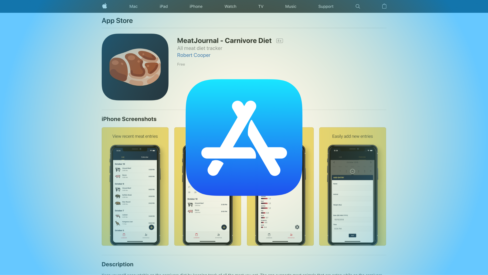
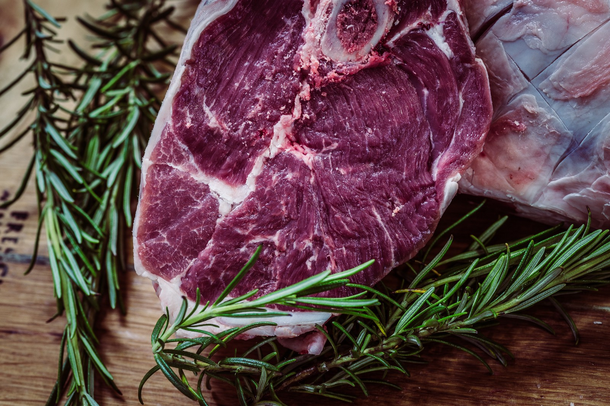
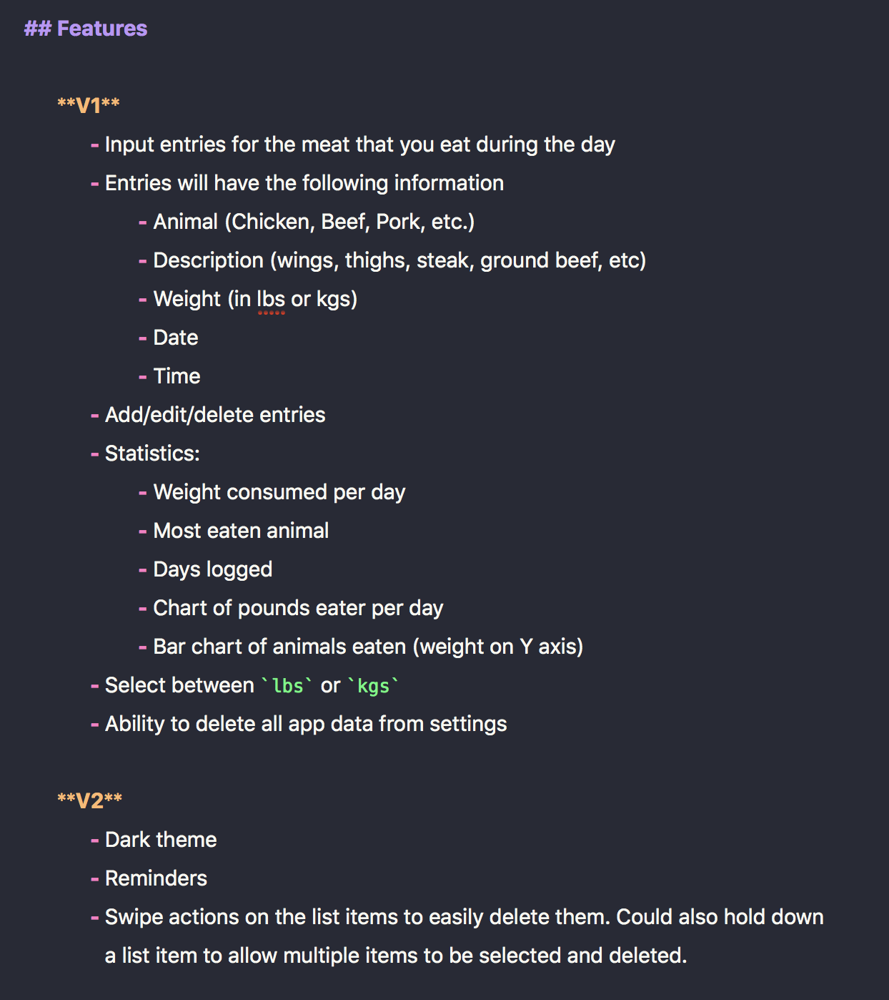
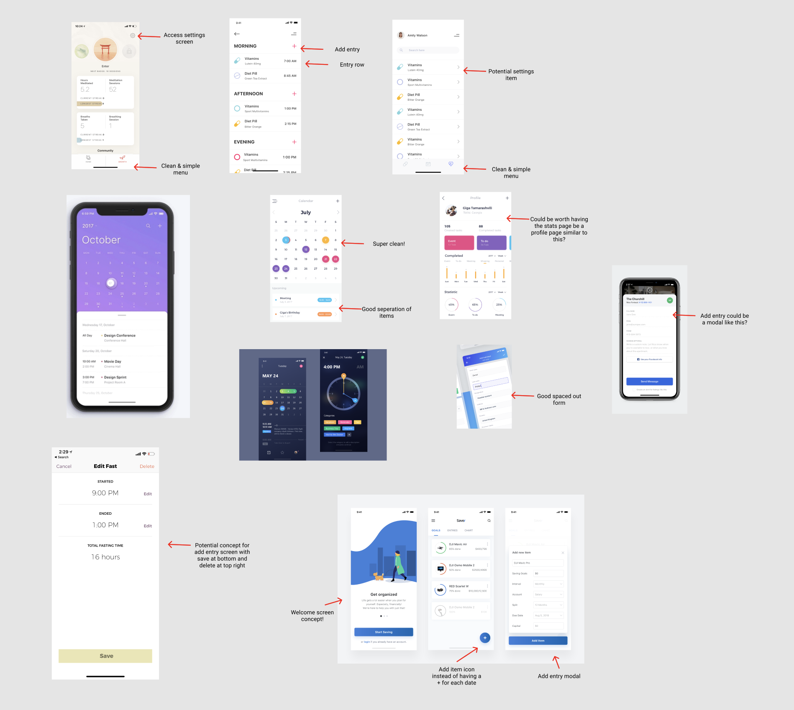
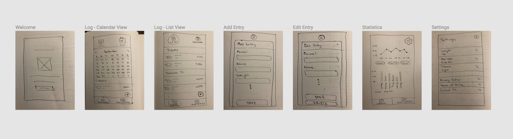
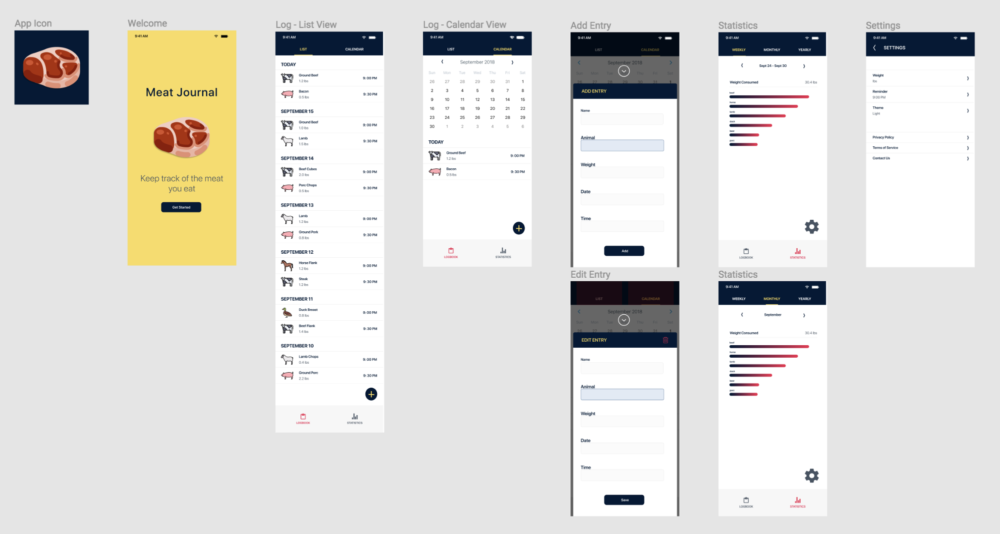
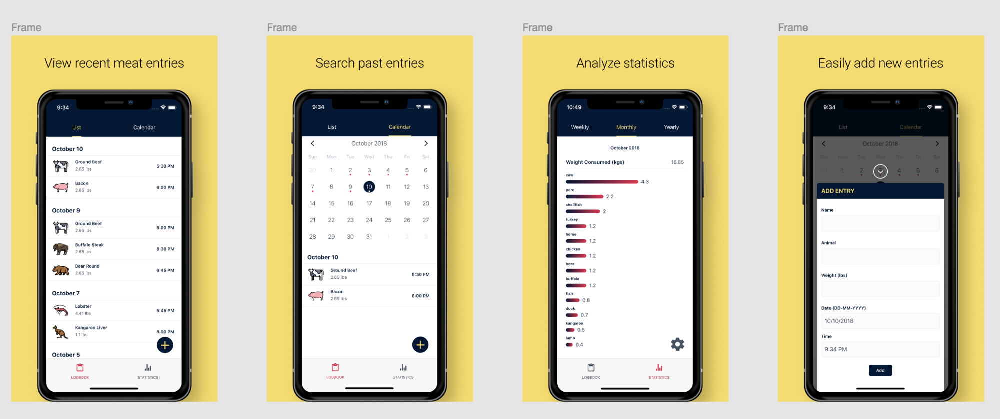
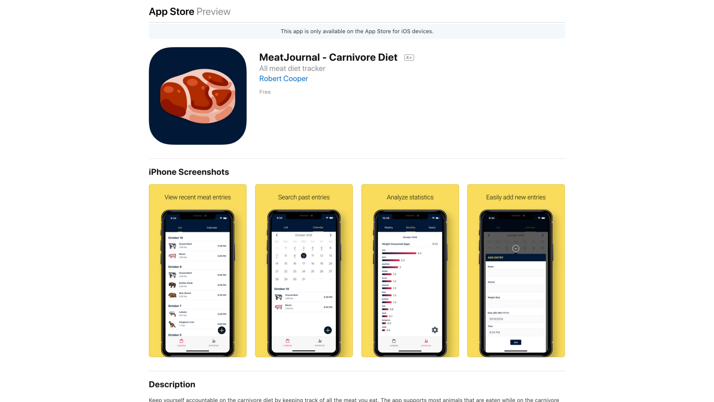

import Link from "$components/Link";

I recently got my first iPhone app accepted into the Apple App Store. It is quite exciting to be able to have a product i’ve been working on by myself now available for a whole bunch of people to download. I tried to use a structured approach for the whole app creation/release process and I’ve outline that process in this article.

## Motivation

Why did I want to build an iOS app in the first place? Well, I like **building out things that could be of use to myself and others**. Creating an app downloadable from the App Store makes it very easy for others to get the app on their phone and start using it. I have a bit of experience working with React Native at one of my previous jobs, so I was confident I could build the app myself.

There is also the **possibility for me to generate some passive income with iOS apps**, if I choose to monetize the app. I realize that the majority of apps in the app store make very little, so this is by no means my primary objective.

## App Idea

I wanted to **build an app that I would want to use**, but that others would also want to use. I also, didn’t want to create something that already exists since I wanted to provide a unique solution to a problem. A lot of developers create games for the App Store, but I did not want to do that since I don’t play games on my iPhone and I find that games generally don’t positively impact a person when they play them.

I’m someone that’s interested in keeping up-to-date with the latest in health, nutrition, and performance, and I’ve noticed a dieting trend called the [**carnivore diet**](https://meat.health/knowledge-base/carnivore-diet-what-to-eat/), that a lot of people have been benefiting from. Out of curiosity, I decided to try the diet, and I quite enjoy it, so I’ve stuck with it so far. The diet only allows for meat products to be eaten.

Since the carnivore diet is something that is a fairly recent phenomena, there weren’t any apps catered towards the diet and so I thought that might be a good void to fill. I got the **idea of creating a food journalling app that would only allow for the addition of meat as food entries**.

I decided to go ahead and create a meat journaling app for the carnivore diet (Photo by <Link to="https://unsplash.com/photos/DVRXFIH42d0?utm_source=unsplash&utm_medium=referral&utm_content=creditCopyText">Jez Timms</Link> on <Link to="https://unsplash.com/search/photos/meat?utm_source=unsplash&utm_medium=referral&utm_content=creditCopyText">Unsplash</Link>)

## Planning

Once I decided what my iOS app would be about, I **wrote a summary of what I wanted the app to do** so that I could keep it in mind while looking at features to add. Here’s what I came up with:

> An application to record entries of the meat eaten during the day. Targeted towards those following a carnivore diet. The app is simple and doesn’t include calories because people on the carnivore diet just eat until they are full. The app is a way to journal the amount of food eaten. A simple app with no extra fluff.

Notice the emphasis I put on **keeping the app simple**. Since this was my first mobile app, I wanted to make sure I didn’t make things too complicated for myself. Had I envisioned a feature-rich application, I know I would likely get discouraged and potentially give up on the entire project.

Once I had a better idea of what I wanted to build, I started to list out the features I’d like to have in the app. I categorized things under V1 and V2, where V1 are features that should be part of the first version of the app and V2 would be features that would be cool to have in a future release.

The list of features I planned to have in the app for the first and second versions of the app.

## Design

I care greatly for the user interface of applications as I believe it makes an application more enjoyable to use when the application looks good. For my application, I made sure to **look at the design of other mobile apps for inspiration** on how I wanted my app to look. I collected screenshots of some apps I had on my phone as well as designs I found on [dribbble](https://dribbble.com/), and combined them all into a document. In the document, I made notes on the UI elements I liked and how a similar design might fit in with my app.

Annotated design images I compiled related to other mobile app user interfaces.

After I had gathered some inspiration for the UI, I **sketched out wireframes** for the screens I would need in the app. I did this by hand and then uploaded images of the sketches to [Figma](https://www.figma.com), the design app I use.

The hand drawn wireframes for the screens in the app.

Next up, I started building out high fidelity designs for the application. I did this all in Figma, and you can actually [view the designs for yourself](https://www.figma.com/file/FuctAJdJ15WcqL0vw7wdYM5U/Meat-Journal?node-id=0%3A1). I took all the icons from [FlatIcon](https://www.flaticon.com/) and made sure to pay for the rights to use them.

Designs for each screen of the app.

## Development

I decided to **use React Native for the app** as I already had experience with it and did not want to learn a new programming language. I also decided I would **only focus on developing for iOS**, even though React Native also allows you to build for Android. The decision to only focus on iOS is because making everything work exactly as intended on both iOS and Android takes a lot of work. Just because something works on iOS, doesn’t mean it will work on Android. Also, since I own an iPhone and not an Android it made sense to develop on iOS as I could test the app in both a simulator and physical device.

I used a [**React Native boilerplate**](https://github.com/infinitered/ignite-ir-boilerplate-bowser) to quickly get up and running with the app development process. The boilerplate includes [**TypeScript**](https://www.typescriptlang.org/) **and** [**MobX**](https://github.com/mobxjs/mobx), which was really nice to work with. I had never used MobX prior to this project, but I really enjoyed using it to manage the global application state.

I also setup the project with **continuous integration/deployment with** [**Visual Studio App Centre**](https://visualstudio.microsoft.com/app-center/) so that every commit I made to my master branch would build the app and deploy it to Itunes Connect. Itunes Connect is where you can submit your app to the App Store as well as conduct using testing with [TestFlight](https://testflight.apple.com/).

I chose Visual Studio App Centre for the CI/CD of the project because their free tier was able to accommodate all of my needs with 240 minutes of build time per month with a max build time of 30 minutes per build. I wanted to use [Circle CI](https://circleci.com), but their free plan doesn’t allow for builds on MacOS machines, which is required for iOS. I also considered using [Bitrise](https://www.bitrise.io/) since their UI/UX is really nice, but their max build time is 10 minutes per build and my builds were taking just over 10 minutes to complete.

## User Testing

Apple has their own user testing app called **TestFlight**, which allows you to invite others to download and test an app before it gets released to the app store. I didn’t really have a good pool of trustworthy and interested people to test my app, but I did manage to get two of my friends to download my app through TestFlight. **User testing of my app wasn’t really a priority for me as I did not have high expectations for the app.**

Where I did end up **getting a lot of feedback for my app was at a local UI/UX feedback meetup** I attended. I presented my app to a crowd of people who then provided feedback on how the app could be improved along with potential features I might want to add to the app. A lot of people were interested in the app, but I think it’s mainly because the carnivore diet seems so strange.

## App Store Submission

Before submitting to the app store, I made sure to read the [App Store Review Guidelines](https://developer.apple.com/app-store/review/guidelines/) to make sure I didn’t miss anything that I should have done. There is a section of the submission form where you can include notes for the App Reviewers, and **I made sure to leave a detailed description of what exactly the app should be able to do**. I’ve heard that this gives the Apple reviewers more confidence in your app and reduces the likelihood of your app being rejected.

Also, I made sure to **put effort into the screenshots I submitted with the app**, as those act as the initial impression of the app for those viewing the app in the App Store. I followed a typically design trend for the screenshots, where you include a screenshot of the app inside of the frame of an iPhone, with an accompanying short description.

App screenshots I submitted along with my app.

After I submitted my app for approval, I got an email less than 24 hours later saying that my app was approved, and a few hours later my app could be found in the App Store!

The MeatJournal app <Link to="https://itunes.apple.com/ca/app/meatjournal-carnivore-diet/id1438311847?mt=8">in the App Store</Link>.

## Summary

From idea to release, the **entire process took me a month**. Also, in terms of cost, I spent $136 CAD for the Apple Developer License and $15 CAD for the rights of the icons I used in the app. So in total, **I spent $151 CAD (approx. $117 USD) on the app**. The Apple Developer License is good for 1 year, after which I would have to renew the license.

## What’s Next

I’ll continue using the app myself and see if there are other features I want to add to the app. I’ll monitor the number of downloads of the app and gather any feedback from users to see if it’s worth investing more time into further developing the app. I quite enjoyed the entire experience so I may even try to develop more apps for the app store.
