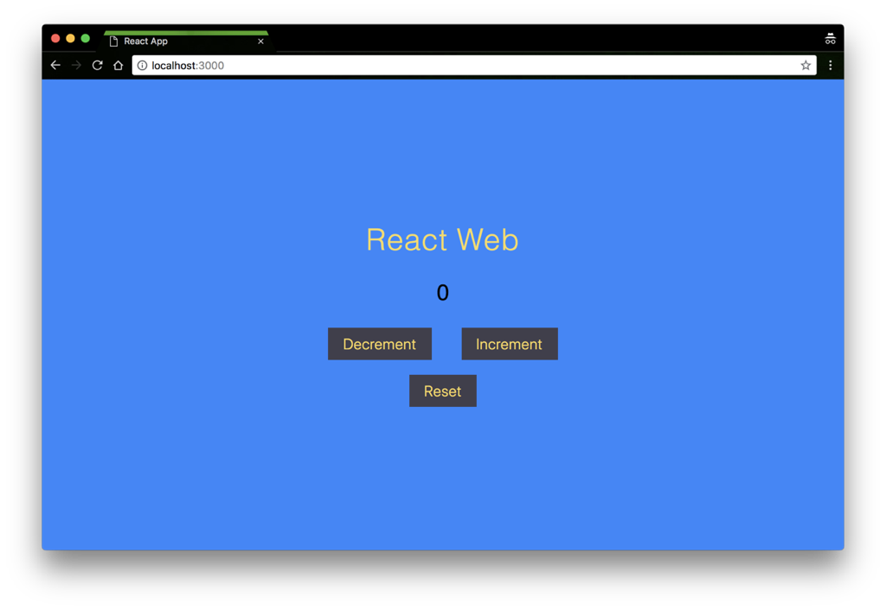
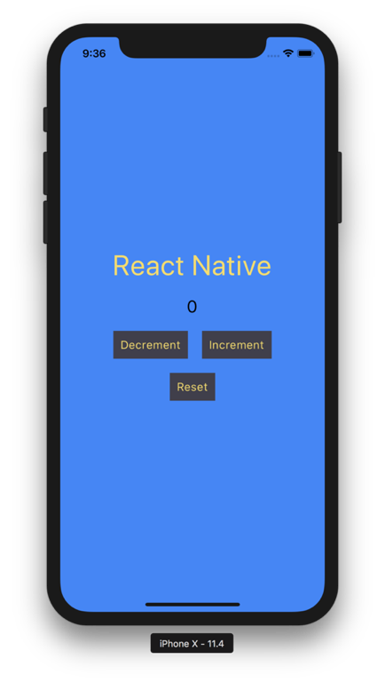
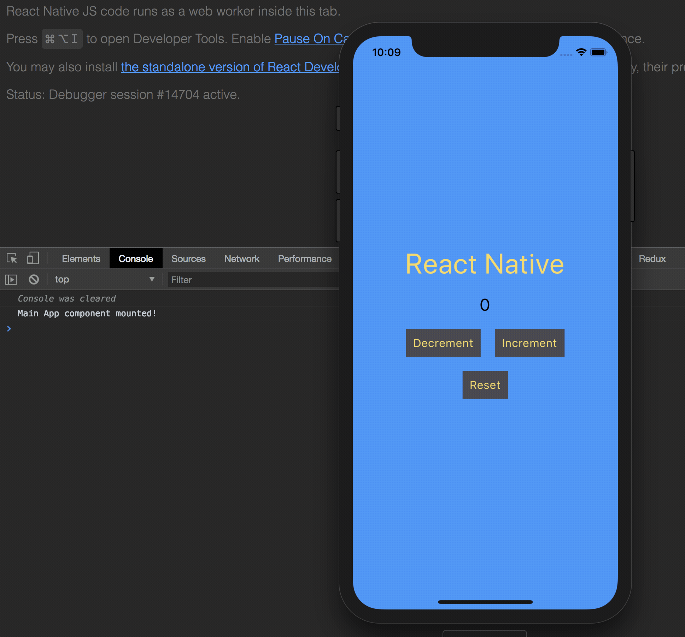

import Link from "$components/Link";

In the past few months I’ve been doing work with React Native, which is a change of pace from the React web apps I was more familiar with developing. Now that i’ve gained experience with React Native, I’m going to explain a bit how React Native differs from React for the web, and what to expect when developing with React Native.

## React

Let’s first briefly talk about React. React is a JavaScript library used for building user interfaces. It was initially released by Facebook in 2013. React uses a concept of a Virtual DOM to represent how your UI should look like while the state of your application changes.

```jsx
render() {
    return (
        <div className="app">
            <p className="title">
                React Web
            </p>
            <span className="count">{this.state.count}</span>
            <div className="buttons-container">'
                <button className="button button--decrement" onClick={this.decrementCount}>Decrement</button>
                <button className="button button--increment" onClick={this.incrementCount}>Increment</button>
            </div>
            <button className="button button--reset" onClick={this.resetCount}>Reset</button>
        </div>
    );
}
```

<span class="caption">A React component’s render method</span>



<span class="caption">Check out this sick React web app I built 🔥</span>

## React Native

React Native is a mobile framework used to build out mobile apps with JavaScript. It, unsurprisingly, uses the React library to construct the UI components as well as define an application’s business logic. It was initially released, again by Facebook, in 2015\. One novel feature React Native development provides that standard native development doesn’t is its live reload feature that can quickly re-compile and serve a bundled javascript file after making changes in the code. This feature has been available on the web for some time, but in the mobile development sphere, it was a new concept.

```jsx
render() {
    return (
        <View style={styles.app}>
            <Text style={styles.title}>React Native</Text>
            <Text style={styles.count}>{this.sate.count}</Text>
            <View style={styles.buttonsContainer}>
                <TouchableOpacity
                    onPress={this.decrementCount}
                    style={styles.button}
                >
                    <Text style={styles.buttonText}>Decrement</Text>
                </TouchableOpacity>
                <TouchableOpacity
                    onPress={this.incrementCount}
                    style={styles.button}
                >
                    <Text style={styles.buttonText}>Increment</Text>
                </TouchableOpacity>
            </View>
            <TouchableOpacity
                onPress={this.resetCount}
                style={[styles.button, styles.resetButton]}
            >
                <Text style={styles.buttonText}>Reset</Text>
            </TouchableOpacity>
        </View>
    )
}
```

<span class="caption">A React Native component’s render method</span>



<span class="caption">Check out this sick React Native app I built 🔥</span>

## Similarities

### Both use…React!

Both the UIs for apps built with React on the web and React Native will have the same general JavaScript structure with `props` , `state` , and all the standard React component lifecycle methods. You can use the same state management libraries (e.g. Redux) in React Native as you would for React on the web.

```jsx
import React from 'react';

export default class AwesomeComponent extends React.Component {
    state = {}
    shouldComponentUpdate() {}
    componentWillMount() {}
    componentDidMount() {}
    componentWillUnmount() {}
    render() {
        return (
            // UI Elements
        );
    }
}
```

<span class="caption">In React Native, you can find all the standard React lifecycle methods you’ve learned to love in React</span>

### JSX

React Native stills uses JSX as the templating language in the component’s render method to define the UI. Although the base components used in React Native aren’t DOM elements, like `<div>`, you still use the same syntax since it’s all JSX.

### Browser Debugging

The JavaScript code in React Native usually gets parsed on a device’s JavaScript engine, called the JavaScript Core. However, if you enable debug mode on a mobile simulator, you will be able to run the JavaScript through a browser’s JS engine and you will therefore have access to tools such as the Chrome debugging tools. This allows you to use `console.log()` statements and read the output in a browser’s console. You can also inspect XHR requests being made and if you’re using Redux, you can take advantage of the [Redux Devtools](https://github.com/zalmoxisus/redux-devtools-extension) as well.



<span class="caption">You can use a brower’s debugging tools with React Native when operating the app in “debug mode”</span>

### package.json

JavaScript dependencies can all be managed with `yarn` or `npm` and you will see all those lovely dependencies tracked in a `package.json` file. This allows you to take advantage of all the packages NPM has to offer and so popular dependencies such as `lodash` , `date-fns`, and `immutable` can be used in React Native projects. However, any dependency that relies on HTML, SVGs or the browser canvas will not be usable with React Native.

## Differences

### Base Components

React native comes with a set of built-in components that can be used to render UI elements on the page. These are different than the standard `<div>`, `<p>`, `<input>`, and other DOM elements that are used with React on the web. Some of the React Native built-in components include `<Text>`, `<View>`, `<TextInput>`, and `<Image>`. There are of course [many other](https://facebook.github.io/react-native/docs/components-and-apis.html) and there are also some 3rd party components that can be downloaded from NPM.

### Styling

Styling isn’t done with CSS in React Native, however the syntax is quite similar. To apply styles in React Native, a [`StyleSheet`](https://facebook.github.io/react-native/docs/stylesheet) object is created and applied to a component’s `style` attribute. The property and values used in the `StyleSheet` object are similar to what you would find in CSS, but the naming uses camelCase and there are also many features missing in the React Native styles that you would otherwise find in regular CSS.

**Styling on the web:**

```jsx
<p className="title">React Web</p>
```

<span class="caption">A class name is associated with a DOM element</span>

```scss
.title {
    letter-spacing: 1px;
    color: #f9dc5c;
    font-size: 40px;
    font-weight: 300;
    margin: 0;
}
```

<span class="caption">CSS targets the element via a classname and assigns a set of properties and values to the associated element</span>

**Styling on native:**

```jsx
<View style={styles.app}>
    <Text style={styles.title}>React Native</Text>
    ...
```

<span class="caption">A style object is assigned to a component’s style attribute</span>

```jsx
const styles = StyleSheet.create({
    app: {
        flex: 1,
        backgroundColor: '#3185FC',
        alignItems: 'center',
        justifyContent: 'center',
    },
    title: {
        fontSize: 40,
        textAlign: 'center',
        letterSpacing: 0.8,
    },
});
```

<span class="caption">The style object is created using the StyleSheet module</span>

### Routing & Navigation

React Native has 2 popular choices for implementing native navigation in an application: [React Navigation](https://reactnavigation.org/) & [React Native Navigation](https://wix.github.io/react-native-navigation/#/). Really great original names if you ask me. Personally, React Native Navigation is the solution I prefer since it uses the actual native navigation API associated with iOS and Android, whereas React Navigation’s implementation is done purely in JavaScript.

Honestly, incorporating Navigation on Native can be painful when dealing with complex nested routing and styling navigation related elements isn’t always obvious. Routing React web apps is much simpler.

### Platform Specific Code

React Native can detect which platform an application is running on (iOS or Android) and serve a different set of code based on that platform. This can either be done by separating React Components into files ending in `ios.js` and `android.js` or it can be done using the Platform module that ships with React Native.

```jsx
<View
    style={[
    Platform.select({
        ios: styles.filterSwitchIOS,
        android: styles.filterSwitchAndroid,
    })
]}
>
```

<span class="caption">The Platform module is used to serve a different set of styles for iOS and android</span>

### JavaScript Runtime

React Native runs its JavaScript through the device’s _JavaScript Core_, unless the app is running in debug mode, in which case the browser’s JavaScript engine parses the JavaScript.

React Native runs on 2 different threads. The _Main_ thread is responsible for rendering the UI and receiving user gestures while the _JavaScript_ thread is responsible for defining the structure of the UI as well as handling the application’s business logic.

The React Native architecture is quite interesting and you can find many good talks on YouTube from the Facebook developers talking about the inner workings of React Native. Here’s two talks worth checking out if you’re interested in learning more: [one](https://www.youtube.com/watch?v=7rDsRXj9-cU), [two](https://www.youtube.com/watch?v=plTTFqbEiEE).

---

## Personal Opinions

Ok, real talk: developing for the web is more pleasant then developing for mobile. React Native doesn’t have as large of a developer community than the the community surrounding web applications, so it isn’t surprising that the tooling isn’t as great for React Native. Debugging code in React Native can be difficult at times which can be the cause of some frustration.

Although React Native is arguably the best tool for cross platform mobile apps, i’m hoping that Progressive Web Applications continue to grow in popularity and will eventually allow for responsive web applications to include native mobile functionality. When that day comes, developers will be able to develop a web application that is responsive, include some native mobile functionalities through browser APIs, and only have to worry about one codebase!

Until then, React Native is a great way to quickly get started with building applications with JavaScript 🚀.
