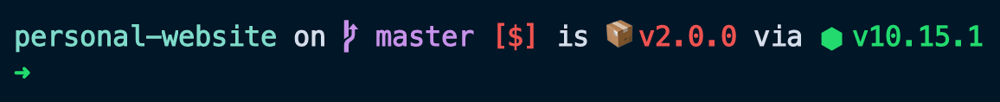
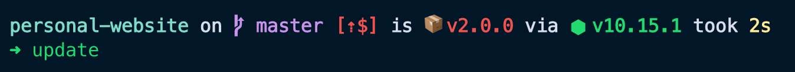
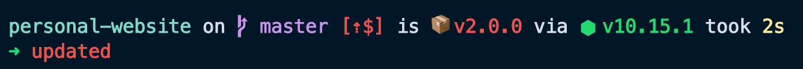
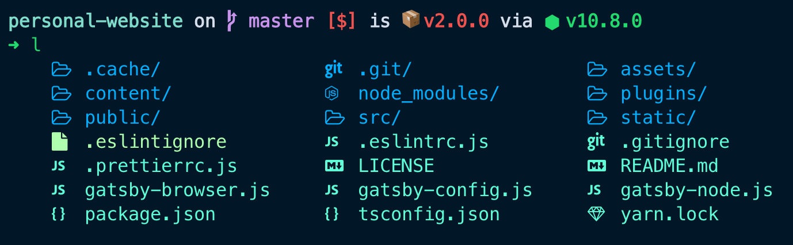
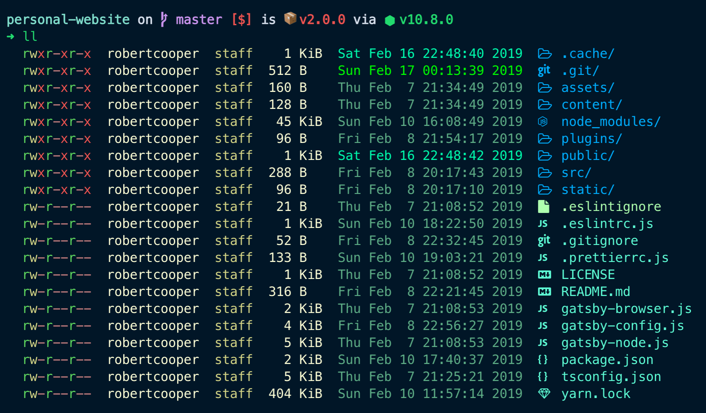
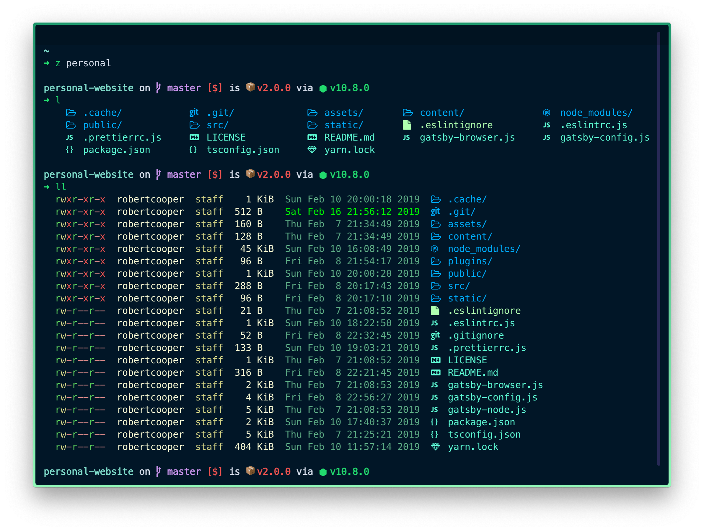
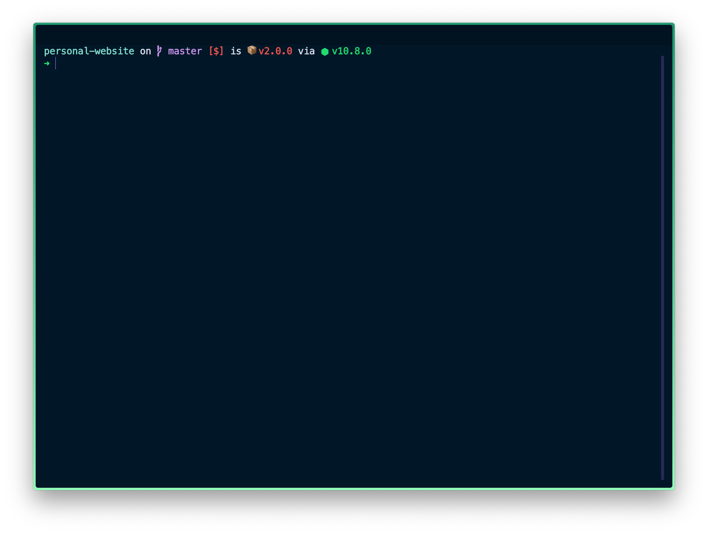
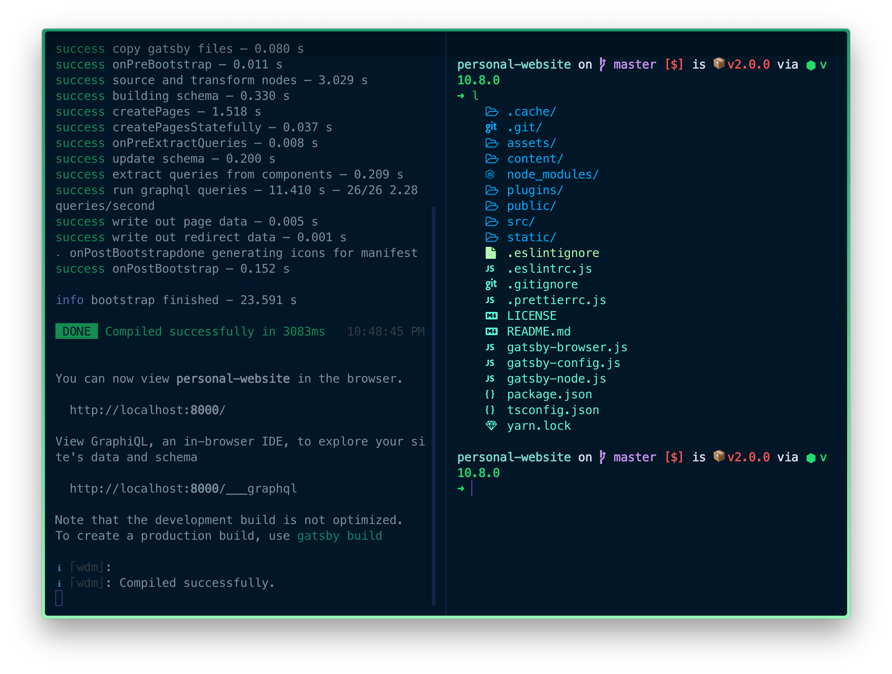
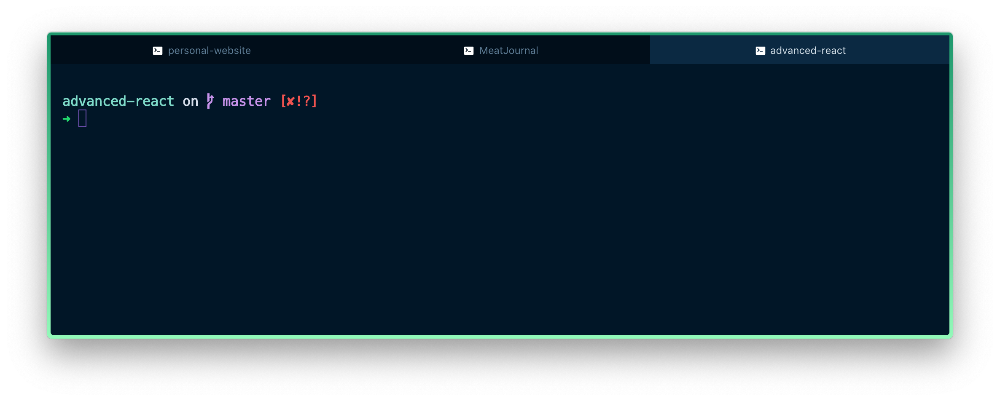

Developers spend a lot of time working in their terminal doing the following tasks:

-   Navigating the file system
-   Manipulating files (creating, updating, reading and deleting)
-   Running git commands
-   Running local servers
-   Running tests
-   And a lot more...

A great developer experience can be achieved for the above mentioned tasks using a combination of <Link to="https://www.zsh.org/">Zsh</Link> as well as <Link to="https://hyper.is/">Hyper</Link>. This article will explain how to optimally set things up to achieve just that.

---

## Zsh

<p><Link to="https://www.zsh.org/">Zsh</Link> is a shell that is very similar to bash, but with <Link to="https://stackabuse.com/zsh-vs-bash/">a few enhancements</Link>. With a few configuration tweaks, this shell can be very powerful.</p>

### Installation

Zsh can be installed through homebrew.

```bash
brew install zsh
```

<span class="caption">Command to install zsh.</span>

Once, installed, you can switch the default shell used in your terminal by running the following command:

```bash
chsh -s /bin/zsh
```

<span class="caption">Command to change default shell to zsh.</span>

Now, you just need to close and re-open your terminal and then you should be running zsh.

### Changing and Updating Zsh Config

Configuration for zsh is done in a `.zshrc` file found in your home directory (i.e. `~`). Whenever a change is made in `.zshrc` and you'd like to see the changes applied to an already open terminal window, you need to run the `source ~/.zshrc` command to propagate the changes to the current terminal session. I've setup 2 aliases to make it easier to edit and update the zsh configuration:

```bash
# Open .zshrc to be edited in VS Code
alias change="code-insiders ~/.zshrc"
# Re-run source command on .zshrc to update current terminal session with new settings
alias update="source ~/.zshrc"
```

<span class="caption">Aliases to change and update <code>.zshrc</code> file.</span>

The above aliases can be added to the `.zshrc` file. With these aliases, the `change` command will open `.zshrc` in VS Code and then the `update` command will apply the new changes an active terminal session. It should noted that you can also simply open a new terminal tab/window to see the newly applied changes.

For a complete look at my Zsh configuration, you can <Link to="https://gist.github.com/robertcoopercode/d761345c35d59c4d831bb8af0c9982d1">take a look at this gist</Link>.

<Quote>
<strong>Note:</strong> A lot of people like to use <Link to="https://github.com/robbyrussell/oh-my-zsh">oh-my-zsh</Link> with Zsh since it facilitates the setup of themes as well as the addition of functionality through the oh-my-zsh plugin system. I've moved away from using oh-my-zsh as I've found that it comes along with a lot of bloat that I don't use.
</Quote>

### Prompt

The prompt is the text that appears before writing out any command in the terminal. Using <Link to="https://denysdovhan.com/spaceship-prompt/">spaceship prompt</Link> with zsh shell, you are presented with a good set of information related to the directory your located in. Spaceship prompt can display the following information:

-   Directory name
-   git repository information (e.g. branch name, files changed, local branch out of date with remote, etc)
-   Current Node version
-   Red prompt character when last command fails
-   Package version (the one found in a `package.json` file)
-   <Link to="https://denysdovhan.com/spaceship-prompt/#features">and more</Link>

To install spaceship prompt run `npm install -g spaceship-prompt`. The command will automatically setup files on your file system as well as include some lines in the `.zshrc` file to load the spaceship prompt for every new terminal session.



<span class="caption">Spaceship prompt displaying the directory name, git branch, package version, and node version.</span>

### Syntax Highlighting

<p><Link to="https://github.com/zsh-users/zsh-syntax-highlighting"><code>zsh-syntax-highlighting</code></Link> allows for colors to be added to shell commands within zsh. Basically, this highlights actual commands in green while highlighting non-commands in red. This is useful to make sure what you are actually typing is a command.</p>



<span class="caption">Zsh syntax highlighting indicating a valid shell command.</span>



<span class="caption">Zsh syntax highlighting indicating an invalid shell command.</span>

To install zsh-syntax-highlighting, run the following commands:

```bash
# Navigate the a folder where we can download the zsh-syntax-highlighting script
# Note: if the zsh folder does not exists in /usr/local/share, just create it
cd /usr/local/share/zsh
# Clone the zsh-syntax-highlighting repo
git clone https://github.com/zsh-users/zsh-syntax-highlighting.git
# Add a startup script to your .zshrc to enable syntax highlighting in new shell sessions
echo "source ${(q-)PWD}/zsh-syntax-highlighting/zsh-syntax-highlighting.zsh" >> ${ZDOTDIR:-$HOME}/.zshrc
```

<span class="caption">Commands to install syntax highlighting in zsh.</span>

Run the `update` command mentioned previously or open a new terminal session to see syntax highlighting enabled for shell commands.

### Directory Navigation

With zsh, you can install a `z` command which will allow you to quickly jump around commonly accessed directories. Using the `z` command followed by the name of a directory, you can navigate to a directory on your computer, no matter where the directory is nested in your file system (as long as you've previously accessed the file in the past). This saves you from navigating your computer's directory structure with the `cd` command.

The nice thing about the `z` command is that it does fuzzy matching, so you don't have to type the full name of a directory in order to be able to navigate to the directory.

In order to install the `z` command, create a <Link to="http://z.sh"><code>z.sh</code></Link> file in the `/usr/local/etc/profile.d` directory on you computer (doesn't have to be in that directory, but by <Link to="https://unix.stackexchange.com/questions/64258/what-do-the-scripts-in-etc-profile-d-do">convention that's where you should place application-specific startup files</Link>). The contents of the `z.sh` file should be taken from the <Link to="https://github.com/rupa/z/blob/master/z.sh">Github repo for the `z` command</Link>.

Then, all you need to do is add the following line to your `.zshrc` file:

```bash
# Allow the use of the z plugin to easily navigate directories
. /usr/local/etc/profile.d/z.sh
```

<span class="caption">Configuration that allows for the usage of the <code>z</code> command.</span>

### Folder and File Icons

Using <Link to="https://github.com/athityakumar/colorls">Color LS</Link>, you're able to list the contents of a directory and display icons beside folder and file names. Its like your normal `ls` terminal command, except it includes icons. This helps to more quickly identify what content exists in a directory. <Link to="https://github.com/athityakumar/colorls#installation">Follow these instructions</Link> to install Color LS.

You're also able to customize the colors and icons used with Color LS. Personally, i've kept the default icons and have <Link to="https://github.com/athityakumar/colorls#custom-configurations">customized the colors using a `dark_colors.yaml` file</Link>. If you're interested in my custom set of colors, <Link to="https://gist.github.com/robertcoopercode/031b14a04697413094ea48a725748466">view this gist</Link> to see the contents of my `dark_colors.yaml` file.

The best way to work with Color LS is to set up an alias for `l` (list folder & file names only) and `ll` (list detailed information for folders & files) to display the contents of a directory. Here is my alias setup in my `.zshrc` configuration file.

```bash
alias l='colorls --group-directories-first --almost-all'
alias ll='colorls --group-directories-first --almost-all --long' # detailed list view
```

<span class="caption">Aliases to more easily use Color LS to display icons alongside folder and file names.</span>



<span class="caption">Using Color LS to display icons alongside the names of files and folders.</span>



<span class="caption">Using Color LS to display a detailed view of files and folders.</span>

### Automatically Switch Node Versions

A lot of project directories contain a `.nvmrc` file which specifies which node version a project uses. The `.nvmrc` file works with <Link to="https://github.com/creationix/nvm">nvm</Link> so a user can run the `nvm use` command to switch to the version of node specified in a `.nvmrc` file. However, an issue some developers run into is that they forget to manually run the `nvm use` command, which causes developers to be using a version of node that may not be compatible with the project they are working on.

Fortunately there is an easy way to automate this with zsh. Zsh gives users the ability to use hook functions to execute commands whenever certain shell actions occur. For example, we can run a script whenever the current working directory is changed in order to run the `nvm use` command if an `.nvmrc` file exists in the directory.

Here is the code to do just that (add this to your `.zshrc` file):

```bash
# Automatically switch node versions when a directory has a `.nvmrc` file
autoload -U add-zsh-hook
# Zsh hook function
load-nvmrc() {
    local node_version="$(nvm version)" # Current node version
    local nvmrc_path="$(nvm_find_nvmrc)" # Path to the .nvmrc file

    # Check if there exists a .nvmrc file
    if [ -n "$nvmrc_path" ]; then
    local nvmrc_node_version=$(nvm version "$(cat "${nvmrc_path}")")

    # Check if the node version in .nvmrc is installed on the computer
    if [ "$nvmrc_node_version" = "N/A" ]; then
        # Install the node version in .nvmrc on the computer and switch to that node version
        nvm install
    # Check if the current node version matches the version in .nvmrc
    elif [ "$nvmrc_node_version" != "$node_version" ]; then
        # Switch node versions
        nvm use
    fi
    # If there isn't an .nvmrc make sure to set the current node version to the default node version
    elif [ "$node_version" != "$(nvm version default)" ]; then
    echo "Reverting to nvm default version"
    nvm use default
    fi
}
# Add the above function when the present working directory (pwd) changes
add-zsh-hook chpwd load-nvmrc
load-nvmrc
```

<span class="caption">Configuration to automatically change node versions with nvm.</span>

Now any time you switch to a directory with a `.nvmrc` file, you will automatically switch to the node version specified in the `.nvmcrc` file.

---

## Hyper Terminal

<p><Link to="https://hyper.is/">Hyper</Link> is a terminal app that's built with JavaScript <Link to="https://github.com/zeit/hyper/blob/canary/package.json#L197">using React for the UI</Link> and <Link to="https://electronjs.org/">packaged with Electron</Link> to make it available as a desktop app across Mac, Windows, and Linux platforms. The best parts of Hyper are its UI, plugin system, and configurability. You can <Link to="https://hyper.is/">download Hyper from their website</Link>.</p>



<span class="caption">An example of how Hyper terminal can look like.</span>

### Configuration

The configuration of Hyper is done within a `.hyper.js` file found in your home directory. A quick way to edit this file is to open the Hyper app and then use the `⌘+,` shortcut which will open `.hyper.js` in your default code editor.

The configuration file is where settings such as font size, colors, shells (e.g. bash, zsh, fish), and plugins can be configured. One important note is that plugins will overwrite your own config values specified in `.hyper.js`. For example, if you use a theme plugin which will set all the colors in your Hyper terminal, then all the colors you've specified in your `.hyper.js` will not take effect.

<Quote>See <Link to="https://gist.github.com/robertcoopercode/276d7cf66e9b0eea48c117fff1762a17">this gist</Link> to view my current Hyper configuration.</Quote>

### Border

One of the first things that might stand out from my terminal setup is the border surrounding the terminal. This can be added by using the <Link to="https://github.com/webmatze/hyperborder">hyperborder</Link> plugin and the colors are specified in a `hyperBorder` config object in `.hyper.js`:

```bash
hyperBorder: {
    borderColors: ['#1D976C', '#93F9B9'],
    blurredColors: ['#177C59', '#84E0A6']
},
```

<span class="caption">Hyper configuration to specify border colors.</span>



<span class="caption">A vibrant green border surrounds the terminal.</span>

### Theming

There are many Hyper theme plugins (with a lot of them listed in the <Link to="https://github.com/bnb/awesome-hyper#themes">awesome-hyper</Link> repository. Personally, I'm using the <Link to="https://github.com/pbomb/hyper-night-owl">hyper-night-owl</Link> theme since it matches the <Link to="https://marketplace.visualstudio.com/items?itemName=sdras.night-owl">Night Owl</Link> theme I use in VS Code.

### Tabs and Panes

#### Panes

You're able to split planes with `⌘+d` (vertical panes) and `⌘+⇧+d` (horizontal panes). I usually like to split panes when I want to do multiple things in the same project. For example, I might use one pane to compile assets and start a local web server, another pane to run tests, and then a third pane to run any other commands for the project.



<span class="caption">Splitting the current terminal interface into 2 vertical panes.</span>

#### Tabs

You're able to create new tabs using `⌘+t`. I like to create new tabs to separate my terminal views between different projects.



<span class="caption">Hyper terminal split up into 3 tabs.</span>

In order to keep the tab title minimal, I only include the name of the current directory. To do this with Zsh, we can create a `precmd` function hook in our `.zshrc` file which will be executed before each prompt:

```bash
# Uses the zsh precmd function hook to set the tab title to the current working directory before each prompt
function precmd () {
    window_title="\\033]0;${PWD##*/}\\007"
    echo -ne "$window_title"
}
```

<span class="caption">Configuration to set the tab title to the name of the current directory.</span>

### Terminal Performance

Hyper has recently updated their terminal to [version 3](https://github.com/zeit/hyper/releases/tag/3.0.0) which comes with a major performance boost. This was for a long time one of the biggest problems with using Hyper since it relied on a DOM renderer which is inherently slow. This would cause the terminal to run slowly and crash when trying to run some CPU intensive commands. However, with the new renderer based on WebGL, the performance is greatly improved.

---

Hopefully this article has given you ideas on how to improve your terminal setup. If you have your own unique terminal setups that help improve your development experience I'd love to hear about them.
