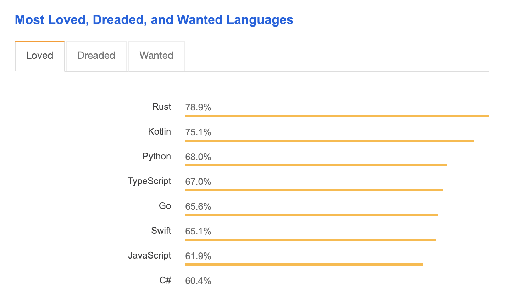
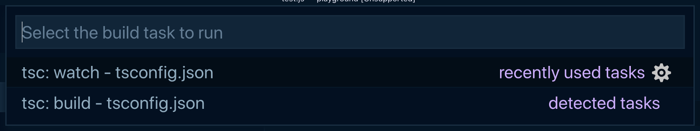

Based on the <Link to="https://insights.stackoverflow.com/survey/2018/">Stack Overflow Developer survey in 2018</Link>, TypeScript is more "loved" as a programming language than JavaScript. The reason TypeScript is so loved amongst JavaScript developers is because adding types to JavaScript allows you to spot errors before running your code. The errors provided by the TypeScript compiler will give a good indication of how an error can be fixed. Adding types to JavaScript also allows code editors to provide some more advanced features, such as code completion, project-wide refactoring, and automatic module importing.



<span class="caption">Results of the "most loved programming languages" survey question from the 2018 Stack Overflow Developer Survey</span>

Learning TypeScript might seem intimidating if you come to think of it as a completely new programming language. However, TypeScript is just an added layer to JavaScript and you by no means have to know every bit of syntax that comes along with TypeScript before you can start using it. TypeScript allows you to easily convert a JavaScript file by changing the file extension from .js to .ts and all the code will compile properly as TypeScript. You can configure TypeScript to be more restrictive if you want to enforce a larger percentage of type coverage in your TypeScript files, but that can be done once you get more familiar with the language.

This article aims to bring you up to speed with around 95% of the scenarios you will typically encounter in a standard TypeScript project. For that last 5%, well, Google is your friend and I've added links to useful TypeScript resources at the bottom of the article.

---

## Setting Up TypeScript

Of course, to begin writing TypeScript that compiles correctly, a properly configured development environment is required.

**1. Install the TypeScript compiler**

To start off, the TypeScript compiler will need to be installed in order to convert TypeScript files into JavaScript files. To do this, TypeScript can either be installed globally (available anywhere in your file system) or locally (only available at the project level).

```bash
# NPM Installation Method

npm install --global typescript # Global installation
npm install --save-dev typescript # Local installation

# Yarn Installation Method

yarn global add typescript # Global installation
yarn add --dev typescript # Local installation
```

<span class="caption">Commands to run from the command line to install TypeScript globally or locally on your computer</span>

**2. Make sure your editor is setup to support TypeScript**

You'll want to make sure your editor is properly configured to work with TypeScript. For example, you may need to install a plugin (such as atom-typescript if using the atom editor), in order to fully take advantage of TypeScript in your editor. If using VS Code, TypeScript support is built-in, so there are no extensions required 😎.

**3. Create a tsconfig.json file**

A tsconfig.json file is used to configure TypeScript project settings. The tsconfig.json file should be put in the project's root directory. The file allows you to configure the TypeScript compiler with different options.

You can have the tsconfig.json contain an empty JSON object if you just want to get TypeScript to work, but if you need the TypeScript compiler to behave differently (such as output transpiled JavaScript files in a specific output directory), you can read more about which settings can be configured.

> _Note:_ You can also run the tsc --init to generate a tsconfig.json file with some default options set for you and a bunch of other options commented out

**4. Transpile TypeScript to JavaScript**

In order to transpile your TypeScript code to JavaScript, the tsc command needs to be run in the terminal. Running tsc will have the TypeScript compiler search for the tsconfig.json file which will determine the project's root directory as well as which options to use when compiling the TypeScript and transpiling .ts files to .js files.

To quickly test that the setup works, you can create a test TypeScript file and then run tsc in the command line and see if a JavaScript file is generated beside the TypeScript file.

For example, this TypeScript file…

```typescript
const greeting = (person: string) => {
    console.log('Good day ' + person);
};

greeting('Daniel');
```

<span class="caption">Example TypeScript syntax</span>

Should transpile to this JavaScript file…

```javascript
var greeting = function(person) {
    console.log('Good day ' + person);
};

greeting('Daniel');
```

<span class="caption">JavaScript file that gets generated from transpiling TypeScript</span>

If you'd like for the TypeScript compiler to watch for changes in your TypeScript files and automatically trigger the transpilation of .ts to .js files, you can run the tsc -p. command in your project's repository.

In VS Code, you can use ⌘⇧B to bring up a menu that can run the transpiler in either normal or watch modes (tsc:build or tsc:watch, respectively).



<span class="caption">The VS Code build tasks menu that can be brought up using ⌘⇧B</span>

---

## Understanding Static and Dynamic Types

JavaScript comes with 7 _dynamic_ types:

-   Undefined
-   Null
-   Boolean
-   Number
-   String
-   Symbol
-   Object

The above types are called _dynamic_ since they are used at runtime.

TypeScript brings along _static_ types to the JavaScript language, and those types are evaluated at compile time (without having to run the code). _Static_ types are what predict the value of _dynamic_ types and this can help warn you of possible errors without having to run the code.

---

## Basic Static Types

Alright, let's dive into the syntax of TypeScript. What follows are the most commonly seen types in TypeScript.

> **Note:** I've left out the never and object types since, in my experience, they are not very commonly used.

### boolean

The simple `true` and `false` values you've come to know and love.

```typescript
let isAwesome: boolean = true;
```

<span class="caption">boolean type annotation</span>

### string

Textual data surrounded in either single quotes (`'`), double quotes (`"`), or back ticks (`\``).

```typescript
let name: string = 'Chris';
let breed: string = 'Border Collie';
```

<span class="caption">string type annotation</span>

If using back ticks, the string is called a <Link to="https://developer.mozilla.org/en-US/docs/Web/JavaScript/Reference/Template_literals">_template literal_</Link> and expressions can be interpolated within them.

```typescript
let punchline: string = 'Because it was free-range.';
let joke: string = `
	Q: Why did the chicken cross the road?
	A: ${punchline}
`;
```

<span class="caption">string type annotation with the use of template literals</span>

### number

Any floating point number is given the type of `number`. The <Link to="https://developer.mozilla.org/en-US/docs/Web/JavaScript/Guide/Numbers_and_dates#Numbers">four types of number literals</Link> that are supported as part of TypeScript are _decimal_, _binary_, _octal_ and _hexadecimal_.

```typescript
let decimalNumber: number = 42;
let binaryNumber: number = 0b101010; // => 42
let octalNumber: number = 0o52; // => 42
let hexadecimalNumber: number = 0x2a; // => 42
```

<span class="caption">number type annotation</span>

> **Note:** If the binary, octal, and hexadecimal numbers confuse you, you're not alone.

### array

Array types in TypeScript can be written in two ways. The first way requires that `[]` be postfixed to the type of elements that are found in the array.

```typescript
let myPetFamily: string[] = ['rocket', 'fluffly', 'harry'];
```

<span class="caption">array of strings using the square bracket notation</span>

The alternative way to write `Array` types is to use Array followed by the type of elements that are found in the array (within angle brackets).

```typescript
let myPetFamily: Array<string> = ['rocket', 'fluffly', 'harry'];
```

<span class="caption">array of strings using the angle bracket notation</span>

### tuple

A `tuple` is an array that contains a fixed number of elements with associated types.

```typescript
let myFavoriteTuple: [string, number, boolean];

myFavoriteTuple = ['chair', 20, true]; // ✅
myFavoriteTuple = [5, 20, true]; // ❌ - The first element should be a string, not a number
```

<span class="caption">Declaring a tuple with 3 elements and then assigning values to the tuple</span>

### enum

An `enum` is a way to associate names to a constant value, which can be either a number or a string. Enums are useful when you want to have a set of distinct values that have a descriptive name associated with it.

By default, enums are assigned numbers that start at `0` and increase by `1` for each member of the enum.

```typescript
enum Sizes {
    Small,
    Medium,
    Large,
}

Sizes.Small; // => 0
Sizes.Medium; // => 1
Sizes.Large; // => 2
```

<span class="caption">Example of an enum starting at 0</span>

The first value can be set to a value other than `0`.

```typescript
enum Sizes {
    Small = 1,
    Medium,
    Large,
}

Sizes.Small; // => 1
Sizes.Medium; // => 2
Sizes.Large; // => 3
```

<span class="caption">Example of an enum starting at a value other than 0</span>

Enums are by default assigned numbers, however, string values can also be assigned to an enum.

```typescript
enum ThemeColors {
    Primary = 'primary',
    Secondary = 'secondary',
    Dark = 'dark',
    DarkSecondary = 'darkSecondary',
}
```

<span class="caption">Example of an enum with string values</span>

### any

If the type of a variable is not known and we don't want the type checker to complain at compilation time, then the type of `any` can be used.

```typescript
let whoKnows: any = 4; // assigned a number

whoKnows = 'a beautiful string'; // can be reassigned to a string
whoKnows = false; // can be reassigned to a boolean
```

<span class="caption">Example of the any type</span>

`any` will likely frequently be used when starting out with TypeScript. However, it's best to try to reduce the usage of any since the usefulness of TypeScript decreases when the compiler isn't aware of the types associated with variables.

### void

When there is no type associated with something, the `void` type should be used. It is most commonly used when specifying the return value of a function that doesn't return anything.

```typescript
const darkestPlaceOnEarth = (): void => {
    console.log('Marianas Trench');
};
```

<span class="caption">Example of using the void type</span>

### null and undefined

Both `null` and `undefined` correspond to the types of the `null` and `undefined` values you might see in JavaScript. These types aren't very useful when used on their own.

```typescript
let anUndefinedVariable: undefined = undefined;
let aNullVariable: null = null;
```

<span class="caption">Example of how the null and undefined types could be used</span>

By default the `null` and `undefined` types are _subtypes_ of all other types, meaning that a variable of type string can be assigned a value of `null` or `undefined`. This is often undesirable behavior and thus it's usually recommended to set the `strictNullChecks` compiler option in a `tsconfig.json` file to `true`. Setting the `strictNullChecks` option to `true` makes it so that `null` and `undefined` need to be explicitly set as a type for a variable.

---

## Type Inference

Fortunately, you don' have to specify types absolutely everywhere in your code because TypeScript has what is called _Type Inference_. Type inference is what the TypeScript compiler uses to automatically determine types.

### Basic Type Inference

TypeScript can infer types during variable initialization, when default parameter values are set, and while determining function return values.

```typescript
// Variable initialization
let x = 10; // x is given the number type
```

<span class="caption">Example of type inference where the x variable has an inferred type of number</span>

In the above example, `x` is assigned a number, TypeScript associates the `x` variable with a type of `number`.

```typescript
// Default function parameters
const tweetLength = (message = 'A default tweet') => {
    return message.length;
};
```

<span class="caption">An inferred type of string is given to the message parameter</span>

In the above example, the `message` parameter is assigned a default value which is of type `string`, so therefore the TypeScript compiler infers that `message` is of type `string` and therefore doesn't throw a compilation error when the `length` property is being accessed.

```typescript
function add(a: number, b: number) {
    return a + b;
}

const result = add(2, 4);

result.toFixed(2); // ✅
result.length; // ❌ - length is not a property of number types
```

<span class="caption">An inferred type of number is assigned to the return value of the add function based on the types of the function's parameters</span>

In the above example, since TypeScript is told that both parameters to the `add` function have a type of `number`, it can infer that the return type will also be a `number`.

### Best Common Type Inference

When a type is being inferred from multiple possible types, TypeScript uses a _Best Common Type_ algorithm to pick a type that works with all the other candidates.

```typescript
let list = [10, 22, 4, null, 5];

list.push(6); // ✅
list.push(null); // ✅
list.push('nope'); // ❌ - type 'string' is neither of type 'number' or 'null'
```

<span class="caption">The best common type algorithm determines that only number and null types should be allowed as elements to the list array</span>

In the above example, the array is composed of both `number` and `null` types, and therefore TypeScript expects only `number` and `null` values to be a part of the array.

---

## Type Annotation

When the Type Inference system is not enough, you will need to declare types on variables and objects.

### Basic Types

All the types introduced in the `Basic Static Types` section can be declared using a `:` followed by the name of the type.

```typescript
let aBoolean: boolean = true;
let aNumber: number = 10;
let aString: string = 'woohoo';
```

<span class="caption">Examples of annotating basic types</span>

### Arrays

As shown in the section talking about the `array` type, arrays can be annotated one of two ways.

```typescript
// First method is using the square bracket notation
let messageArray: string[] = ['hello', 'my name is fred', 'bye'];

// Second method uses the Array keyword notation
let messageArray: Array<string> = ['hello', 'my name is fred', 'bye'];
```

<span class="caption">Annotating arrays</span>

### Interfaces

One way to put together multiple type annotations is by using an interface.

```typescript
interface Animal {
    kind: string;
    weight: number;
}

let dog: Animal;

dog = {
    kind: 'mammal',
    weight: 10,
}; // ✅

dog = {
    kind: true,
    weight: 10,
}; // ❌ - kind should be a string
```

<span class="caption">Annotating types using an interface</span>

### Type Alias

To make things confusing, TypeScript also allows you to specify multiple type annotations using a type alias.

```typescript
type Animal = {
    kind: string;
    weight: number;
};

let dog: Animal;

dog = {
    kind: 'mammal',
    weight: 10,
}; // ✅

dog = {
    kind: true,
    weight: 10,
}; // ❌ - kind should be a string
```

<span class="caption">Annotating types using a type alias</span>

What seems to be the best practice in terms of using an interface or a type alias is that you should generally just pick either `interface` or `type` in your codebase and be consistent. However, if writing a 3rd party public API that can be used by others, use an `interface` type.

If you want to get a more detailed comparison between the type alias and an interface, I would recommend <Link to="https://medium.com/@martin_hotell/interface-vs-type-alias-in-typescript-2-7-2a8f1777af4c">this article</Link> by Martin Hochel.

### Inline Annotations

Instead of creating a re-usable interface, it might be more appropriate to annotate a type inline instead.

```typescript
let dog: {
    kind: string;
    weight: number;
};

dog = {
    kind: 'mammal',
    weight: 10,
}; // ✅

dog = {
    kind: true,
    weight: 10,
}; // ❌ - kind should be a string
```

<span class="caption">Using an inline type annotation</span>

### Generics

There are situations where the specific type of a variable doesn't matter, but a relationship between the types of different variables should be enforced. For those cases, generic types should be used.

```typescript
const fillArray = <T>(len: number, elem: T) => {
    return new Array<T>(len).fill(elem);
};

const newArray = fillArray<string>(3, 'hi'); // => ['hi', 'hi', 'hi']

newArray.push('bye'); // ✅
newArray.push(true); // ❌ - only strings can be added to the array
```

<span class="caption">Using generic types to define type relationships</span>

The above example has a generic type `T` that corresponds to the type of the second argument passed to the `fillArray` function. The second argument passed to the `fillArray` function is a string, and therefore the created array will have all of its elements set to have a type of `string`.

It should be noted that it is by convention that single letters are used for generic types (e.g. `T` or `K`). However, there is nothing stopping your from using more descriptive names for your generic types. Here is the above example with a more descriptive name for the supplied generic type:

```typescript
const fillArray = <ArrayElementType>(len: number, elem: ArrayElementType) => {
    return new Array<ArrayElementType>(len).fill(elem);
};

const newArray = fillArray<string>(3, 'hi'); // => ['hi', 'hi', 'hi']

newArray.push('bye'); // ✅
newArray.push(true); // ❌ - only strings can be added to the array
```

<span class="caption">Using more descriptive names for generic types</span>

### Union Type

In scenarios where a type can be one of multiple types, a union type is used by separating the different type options with a `|`.

```typescript
// The `name` parameter can be either a string or null
const sayHappyBirthdayOnFacebook = (name: string | null) => {
    if (name === null) {
        console.log('Happy birthday!');
    } else {
        console.log(`Happy birthday ${name}!`);
    }
};

sayHappyBirthdayOnFacebook(null); // => "Happy birthday!"
sayHappyBirthdayOnFacebook('Jeremy'); // => "Happy birthday Jeremy!"
```

<span class="caption">An example of a union type annotation</span>

### Intersection Type

An intersection type uses the `&` symbol to combine multiple types together. This is different than the union type, as a union type says "_the resulting type is **one** of the listed types_" whereas the intersection type says "_the resulting type is the combination of **all** listed types_".

```typescript
type Student = {
    id: string;
    age: number;
};

type Employee = {
    companyId: string;
};

let person: Student & Employee;

person.age = 21; // ✅
person.companyId = 'SP302334'; // ✅
person.id = '10033402'; // ✅
person.name = 'Henry'; // ❌ - name does not exist in Student & Employee
```

<span class="caption">An example of an intersection type annotation</span>

### Tuple Type

Tuples are annotated using a `:` followed by a comma separated list of types within square brackets.

```typescript
let list: [string, string, number];

list = ['apple', 'banana', 8.75]; // ✅
list = ['apple', true, 8.75]; // ❌ - the second argument should be of type string
list = ['apple', 'banana', 10.33, 3]; // ❌ - the tuple specifies a length of 3, not 4
```

<span class="caption">Annotating a variable using a tuple type</span>

### Optional Types

There may be instances where a function parameter or object property is optional. In those cases, a `?` is used to denote these optional values.

```typescript
// Optional function parameter
function callMom(message?: string) {
    if (!message) {
        console.log('Hi mom. Love you. Bye.');
    } else {
        console.log(message);
    }
}

// Interface describing an object containing an optional property
interface Person {
    name: string;
    age: number;
    favoriteColor?: string; // This property is optional
}
```

<span class="caption">Defining optional types</span>

---

## Useful Resources

For the parts of TypeScript that weren't covered in this article, I recommend the following resources.

<p><Link to="https://www.typescriptlang.org/docs/handbook/basic-types.html">TypeScript Handbook (Official TypeScript docs)</Link></p>

<p><Link to="https://basarat.gitbooks.io/typescript/content/docs/getting-started.html">TypeScript Deep Dive (Online TypeScript Guide)</Link></p>

<p><Link to="http://2ality.com/2018/04/type-notation-typescript.html">Understanding TypeScript's Type Annotation (Great introductory TypeScript article)</Link></p>
