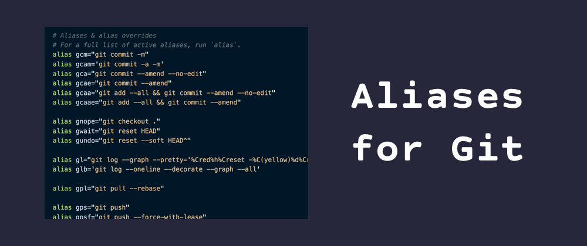
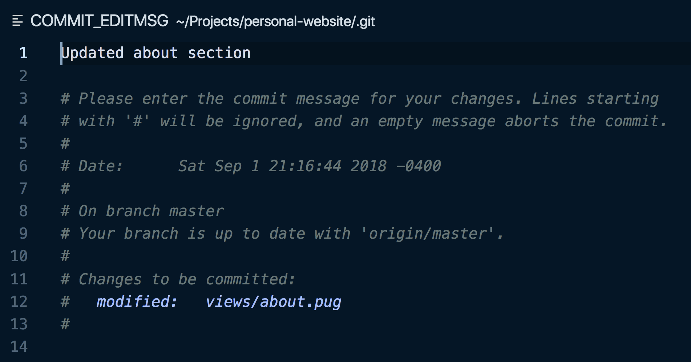
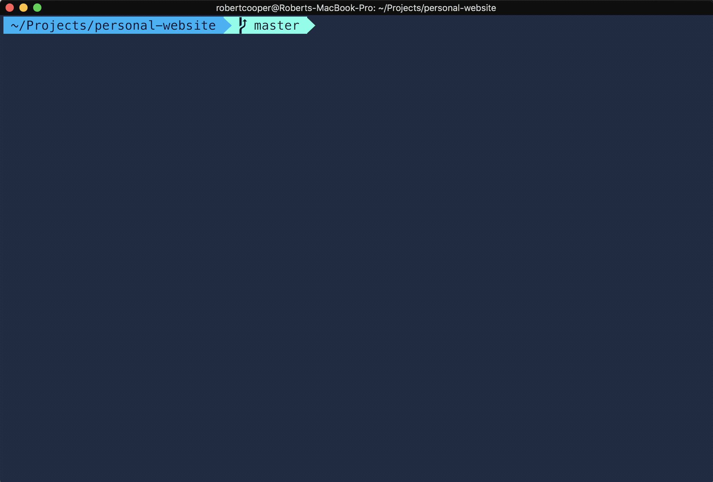
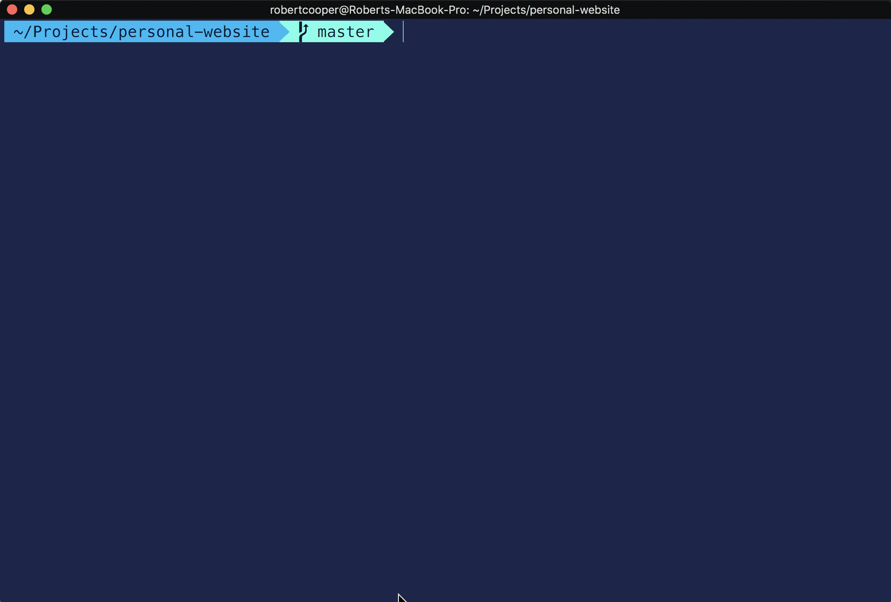

import Link from "$components/Link";



Leveraging aliases when working with git can help make you more efficient with using the popular version control system. Listed below are some of my absolute favourite and most used aliases when working on a project that uses git.

It should be noted that when i'm talking about aliases, I mean <Link to="http://tldp.org/LDP/abs/html/aliases.html">bash/zsh aliases</Link> and not <Link to="https://git-scm.com/book/en/v2/Git-Basics-Git-Aliases">git aliases</Link>.

What's the difference? Bash/Zsh aliases are setup in a `.bashrc` or `.zshrc` file and allows you to assign a command to a shorthand version. For example, you could alias `git log` to be `gl`, which would save you a few characters of typing. Git aliases allow you to similarly assign a git command to a shorthand version, but you still have to type `git` prior to the shorthand. For example, you could alias the `git log` command to be `l` and then you would invoke the command by typing `git l`. All git aliases are set in a `.gitconfig` file which is usually found in a computer's `HOME` directory.

---

## Adding and Amending Commits

### **`gaa`**

```bash
git add -A
```

Adds all changes to staging.

### **`gcm`**

```bash
git commit -m
```

Creates a new commit with all staged files and uses the given message as the commit's message.

**Example:**

```bash
gcm "This is my commit message describing the changes"
```

### **`gcma`**

```bash
git commit -a -m
```

Adds all files to staging and makes a commit using the given message as the commit's message.

**Example:**

```bash
gcam "This is another commit message!"
```

### **`gca`**

```bash
git commit --amend --no-edit
```

Moves the currently saved files into the previous commit message. The `--no-edit` flag is passed to `git commit --amend` to keep the previous commit message (this is usually the case).

If the previous commit message should be changed, I've aliased `git commit --amend --no-edit` to `gcae`. It does the same as `gca`, but it opens up the git editor to edit the previous commit's message. In my case, I've setup `VS Code` to be my default git editor since i'm not proficient with VIM.



### **`gcaa`**

```bash
git add --all && git commit --amend --no-edit
```

This command is useful to use if some changes that have been made should be a part of the previous commit. It will add all newly modified files to staging and then it will `amend` the previous commit with those changes.

### **`gnope`**

```bash
git checkout .
```

Removes all the changes detected by Git.

### **`gwait`**

```bash
git reset HEAD
```

Unstages everything.

### **`gundo`**

```bash
git reset --soft HEAD^
```

Undoes the last commit and moves the files in the commit to staging.

## Reading history

### **`gl`**

```bash
git log --graph --pretty='\''%Cred%h%Creset -%C(yellow)%d%Creset %s %Cgreen(%cr) %C(bold blue)<%an>%Creset'\'' --abbrev-commit
```

Logs previous commits in a concise manner. The argument passed to `--pretty` is defining the information that should get displayed for each commit (i.e. commit hash, branch name, commit message, date of commit, and author). Definitely wouldn't want to type this out every time!

### **`gco`**

```bash
git checkout
```

Allows to switch between branches.

**Example:**

```bash
gco other-branch-name
```

## Pushing & Pulling To/From Remote

### **`gps`**

```bash
git push
```

Updates the remote.

### **`gpsf`**

```bash
git push --force-with-lease
```

Overrides the remote branch with the local branch if no one else has commited to the remote. It is considered to be a safer approach than using `git push --force`.

### **`gpl`**

```bash
git pull --rebase
```

Fetch updates from the remote and rebase the local branch with the upstream branch. This avoids any merge commits that may occur when using `git pull`.

## Rebasing

### **`grb`**

```bash
git rebase
```

Rebases the current branch with another branch.

**Example:**

```bash
grb origin/master
```

### **`grn`** _(shell command)_

```bash
grn() { git rebase -i HEAD~"$1"; }
```

This is actually a <Link to="http://zsh.sourceforge.net/Intro/intro_4.html">shell command</Link> which allows for variables to be passed in as arguments. The `$1` is a placeholder for an argument that gets passed to the `grn` function. This function accepts `N` as an argument, where `N` is the number of commits to perform an interactive rebase on.

**Example:**



### **`grbic`** _(shell command)_

```bash
grbic() { git rebase -i "$1" ; }
```

Accepts a commit hash as an argument and performs an interactive rebase back to the passed commit hash.

**Example:**



### **`grba`**

```bash
git rebase --abort
```

Aborts an interactive rebase and restores the git state to the moment the `git rebase` command was run.

### **`grbc`**

```bash
git rebase --continue
```

Continues an interactive rebase after conflicts on a commit have been resolved.

---

Ok, I know that was a lot of aliases, so sorry for rambling on about them. I would encourage others to start aliases more often to speed up their development. Let me know if any of those were helpful or if you've got some favourite aliases you'd like to share.
