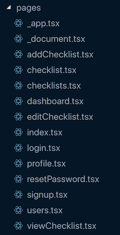

import Video from "$components/mdx/Video";
import Youtube from "$components/mdx/Youtube";
import Comparison from "./Comparison";

Server-side rendering isn't something new, but it's something that's not understood by everybody, especially with the prevalence of client-side rendered apps. I'm going to talk about server-side rendered (SSR) React applications and give my opinion on whether it's worth implementing SSR in a React app.

---

## What is Server-side Rendering?

Server-side rendering is when HTML pages are built on the server rather than in the browser. With client-side rendering, a fairly empty HTML file is first served to the browser and then it's the browser's responsibility to render the entire UI for the application.

## Why Use Server-side Rendering?

There are two primary reasons why you should consider using server-side rendering: **search engine optimization (SEO)** and **perceived performance**.

### Optimal Search Engine Optimization (SEO)

The gold standard for having your web app's pages show up in search engine result pages is to use server-side rendering for your applications. This will ensure that your app can be quickly and effectively crawled and indexed by search engines (by the way, there is a [difference between crawling and indexing](https://www.sureoak.com/difference-crawling-vs-indexing/)).

Client-side rendered (CSR) applications can also be indexed and crawled by search engines, with Google being the best at rendering client-side JavaScript in order to crawl web pages. However, not all search engines can crawl client-side rendered applications as well as Google. Furthermore, since rendering JavaScript takes additional computing resources, Google will delay when it will crawl and index client-side rendered apps.

Check out the following talk at Google I/O 2018 about SEO and JavaScript for more information on best ways to optimize JavaScript web apps for search engines.

<Youtube src="https://www.youtube.com/embed/PFwUbgvpdaQ?controls=0" />

### Better Perceived Performance

Visible content appears sooner with server-side rendering since a rendered HTML page is being sent to the client rather than a blank HTML page that only gets rendered after loading JavaScript/React on the client. Because content appears sooner when using SSR compared to client-side rendering, it is said that perceived performance is better.

That being said, actual performance isn't necessarily better for a server-side rendered application because the app isn't able to be dynamically updated or interacted with until the JavaScript has loaded on the page, which happens around the same time as client-side rendering.

## Client-side Rendering vs Server-side Rendering

Let's walk through the sequence of events followed when initially loading a client-side rendered app and initially loading a server-side rendered app. Note that the loading animations represent time where the user is waiting.

<Comparison/>

The above clearly illustrates why content is more quickly visible to the user (perceived performance) when using server-side rendering. It can also be seen that the app can be interacted with (actual performance) at around the same moment for both client-side and server-side rendering.

Here is the more detailed version for the SSR sequence, including what is actually happening on the server-side.

### Detailed SSR Steps

-   Browser requests a page (client)
-   Server loads React from memory (server)
-   Server renders HTML based on the virtual DOM created by the React app (server)
-   Server sends generated HTML to the browser (server)
-   Content visible to the user
-   Request JS Bundle (client)
-   React app loads in the browser (client)
-   User can interact with app
-   Request API data from the backend (client)
-   Re-render React app with new data (client)

> **Note:** It is possible to request your data at the start of the sequence so that you can have all the required data rendered on the server before sending the first rendered HTML file. Read about [serverless pre-rendering](https://zeit.co/blog/serverless-pre-rendering) for more information on the topic.

## NextJS

NextJS is a framework used to build server-side rendered React applications. It handles a lot of the inherit complexities that come along with server-side rendering. You've got to keep in mind that on the server, you don't have access the the normal browser APIs you might be used to using on the client (such as the [Window object](https://developer.mozilla.org/en-US/docs/Web/API/Window) and the [History object](https://developer.mozilla.org/en-US/docs/Web/API/History)).

NextJS provides an elegant solution for the routing of your application, ways to code split your JavaScript, the ability to prefetch pages, and other server-side related stuff. Pages and routes are defined by creating a React component file in a **pages** directory. For example, creating a `profile.jsx` file inside the **pages** directory will make a page accessible at the **/profile** route in the browser.

NextJS pages are all in the <strong>pages</strong> directory and the filename corresponds to the page's route pathname

The following video demonstrates the code splitting provided by NextJS. Automatically, each page in NextJS is code-splitted, which means that every time you navigate to a page, you only load the JavaScript required for the page to run. Notice how on each new page navigation, a new JavaScript bundle is being loaded.

<Video src="/nextjs-code-splitting" />

Every time a user navigates to a new page, a new JavaScript bundle gets loaded

## Server-side Rendering Drawbacks

React development with SSR is more complex than it is with CSR. Even though NextJS makes the SSR development experience much better, it still has it's own nuances compared to a CSR React app. For example, not all the React related libraries will be compatible with SSR, and even if they are, it might require some non-obvious setup to get them working. Also, if you encounter a bug with a library that is caused by the use of SSR, it may be difficult to get support for it. The majority of people using React libraries are not using server-side rendering so there will be less people experiencing the SSR-related bug and therefore less incentive in fixing it.

Furthermore, although server-side rendering should always have a better perceived performance than a client-side rendered app, it may not actually be more performant. When rendering HTML on the server, the server needs to itself load the React app, and it also needs to run a synchronous method called [`renderToString()`](https://reactjs.org/docs/react-dom-server.html#rendertostring) in order to generate the required HTML markup that will be sent to the client. Because of this, the first server response to the browser will likely be slower for SSR than for a CSR app. Don't forget that after sending the first HTML response to the browser, the browser will still need to load React in the browser, just like with client-side rendering.

Finally, it must be accepted that new features made available in React libraries may not be immediately compatible with server-side rendering. A good example at the time of writing is that the [React.lazy and Suspense](https://reactjs.org/docs/code-splitting.html#reactlazy) features released in one of the latest versions of React is not yet supported with server-side rendering (there are however alternative ways to lazy load components with SSR).

## Is SSR Worth It?

It depends. Let's look at 3 scenarios for an application built with React:

1. **Most or all the content on a web app is static (i.e. no reliance on an external API to display data based on user actions)**

Use a static site generator like GatsbyJS to build all the pages at build time. This will allow the pages to load very quickly and have all the pages properly crawled and indexed by search engines.

2. **A wep app with a lot of dynamic content and most pages accessible only by authenticated users**

Build the app with client-side rendering since most of your pages don't need to be indexed by search engines. This will allow for faster development since the nuances of server-side rendering don't need to be considered. Also, this allows for the usage of client-side code splitting with React.lazy and Suspense to keep JavaScript bundle sizes low.

3. **A web app with a lot of dynamic content and most of the pages accessible by the general public**

You should **seriously consider** Server-side Rendering. You will get better SEO with SSR compared to CSR.

---

Do you have any experience, opinions, or insights related to server-side rendering? If so, feel free to share your thoughts in the comments below.
