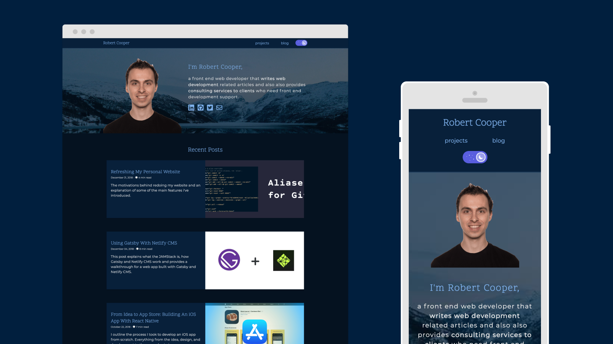
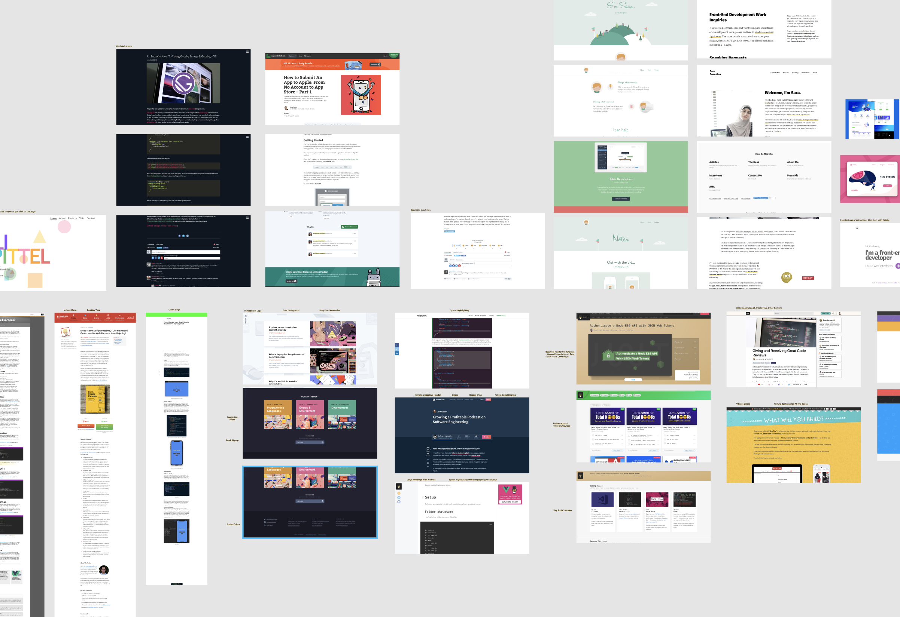
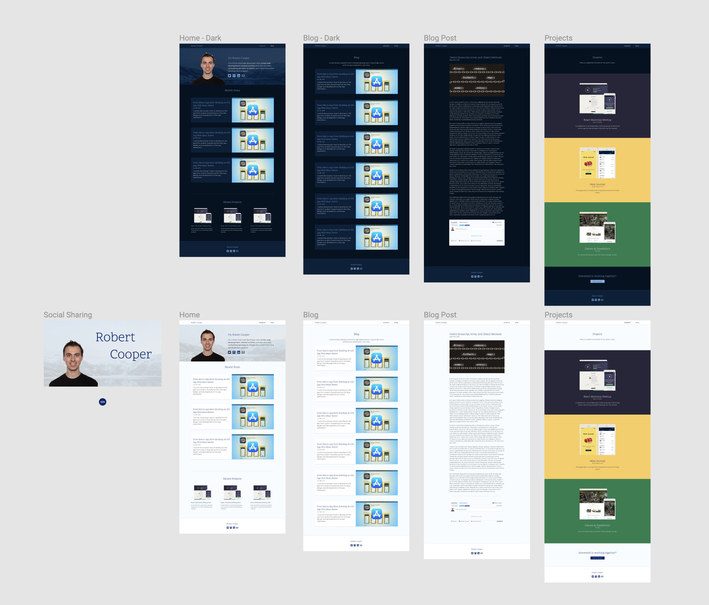
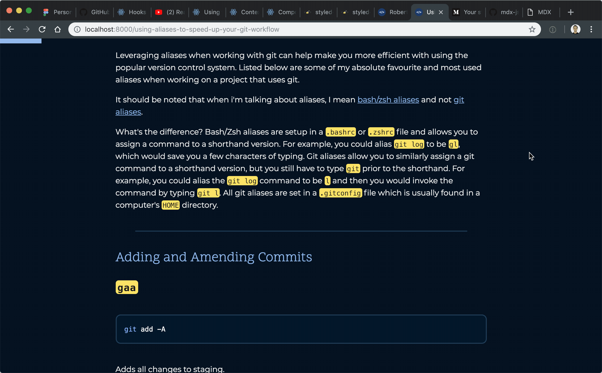
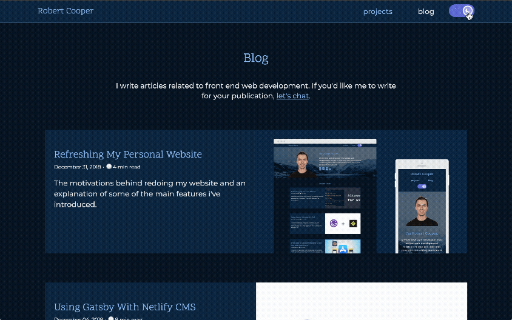

import BlogThemeSwitch from 'components/blog/refreshing-my-personal-website/BlogThemeSwitch';
import GithubButton from 'components/blog/refreshing-my-personal-website/GithubButton';
import Link from "$components/Link";

I've decided to redo my website, yet again. This is the 3rd or 4th iteration of my website.

Here were the motivations and goals for the redesign:

#### 1. Host my blog articles on my own website

I've been writting a lot on both <Link to="https://medium.com/@robertcooper_rc">Medium</Link> and a bit on <Link to="https://dev.to/robertcoopercode">Dev Community</Link>, but I want to have a bit more control in the design and presentation of my blog posts. One of my biggest gripes with Medium is the lack of syntax highlighting for code blocks.

#### 2. Better highlight past projects

In 2019, I want to work with a few clients on a part-time basis to supplement the income I make through my full-time job. The first step to doing that was to make sure I can showcase some of my past work in a favorable light.

#### 3. New tech stack

My previous website was using gulp to build HTML pages from templated <Link to="https://pugjs.org/api/getting-started.html">pug files</Link>. This wasn't that bad since I only had one page on the website, so there wasn't a need to move between pages. However, now that I was going to include a blog, I was going to have to have multiple pages on the website and thus I wanted to use React to get the performance associated with a single page application.

## Design

So with those three goals in mind I started to research blogs that I admired. I made sure to screenshot and anotate any elements that stood out to me. I gathered all those screenshots in my design app of choice: <Link to="https://www.figma.com/">Figma</Link>.

A collection of screenshots from the blogs and websites that I admire.

After I gathered all the pieces of inspiration, I went ahead and designed my own website. I knew I wanted to have both a light and dark theme to my website, so I made sure to design both variations.

The designs for both light and dark theme pages of my new website.

The reason why I create design mockups instead of just coding the site straight away is so that I can quickly test out which designs look good. I find that I end up doing a few design interations before coming up with a final design. Doing those different variations in code rather than in a design software would take much longer. I also find it helps me better organize my work when I design the project before going into the code, and it ultimately saves me time.

## Home Page

The home page, being the first place site visitors land when they visit my site, includes a short description of who I am, the blog articles I've recently written, as well as a preview of the recent projects I've worked on. I made sure to animate elements on the page, using the <Link to="https://github.com/michalsnik/aos">animate on scroll library</Link>, to make the experience slightly more enjoyable.

The home page elements fade into the page as a user scrolls.

## Projects

I've created a page to better showcase my past projects. Each app is presented in a similar way, with screenshots of the apps found within desktop/mobile device frames. Each project is also given it's own section with a short description along with keywords indicating the main technologies used for the projects. A call to action section is found at the bottom of the page for any visitors interested in working together on a project.

In the future, I plan to create full pages for each project in order to present them as full blown case studies.

The new projects page of the website showcases three recent projects and a call to action link at the bottom of the page.

## Blog

The blog is where things get exciting technology wise. The website is built with React and <Link to="https://www.gatsbyjs.org/">Gatsby</Link>. I'm also using <Link to="https://gatsby-mdx.netlify.com/">gatsby-mdx</Link> which allows me to write my blog posts using MDX. <Link to="https://github.com/mdx-js/mdx">MDX</Link> is a different flavour of Markdown which allows for the use of JSX and React components to coexist with markdown in the same file.

If I want to include a custom React component into a blog post to make the post more interactive, I can now do that in MDX. As an example, I can embed the theme switcher component I'm using for my website right into this post:

<BlogThemeSwitch />

I'm quite excited to take advantage of the power of MDX in some of my future blog articles.

Another feature I've added to my blog is the horizontal progress bar indicating a user's progress through a blog post. I've seen this UI pattern on some other blogs and have enjoyed it myself.

An horizontal progress bar at the top of a blog article indicates how much further a user needs to scroll to reach the bottom of the page.

I've also include a comment section to blog posts using the Disqus embed. This was surprisingly easy to incorporate into the website using <Link to="https://github.com/disqus/disqus-react">disqus-react</Link>.

## Dark / Light Theme

Perhaps my favourite part of the website is the ability to toggle between a dark and light themes. I'm using <Link to="https://www.styled-components.com/">Styled Components</Link> to manage the styles on my website and it fortunately has great a <Link to="https://www.styled-components.com/docs/advanced#theming">API for managing theming</Link>.

Toggling between dark and light theme.

I'd like to point out that the design and functionality of the theme toggle switch was all taken from <Link to="https://twitter.com/thekitze">@thekitze</Link>'s Twizzy App <Link to="https://twizzy.app/">landing page</Link>. I'm always thankful when talented people like this make their projects open source to allow others to benefit.

---

I hope to continue to make incremental improvements to my website. Some of the things I'd like to add include unit testing, end to end testing, and an RSS feed to the website. There are also a few bugs I need to squash 👞🐜.

<GithubButton />
