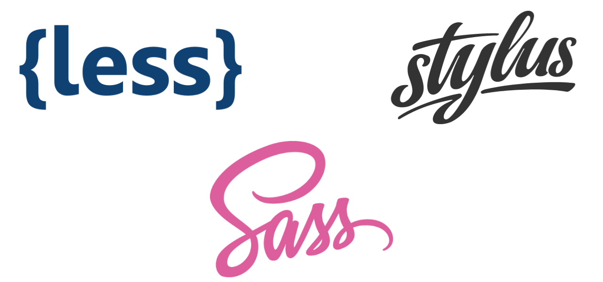
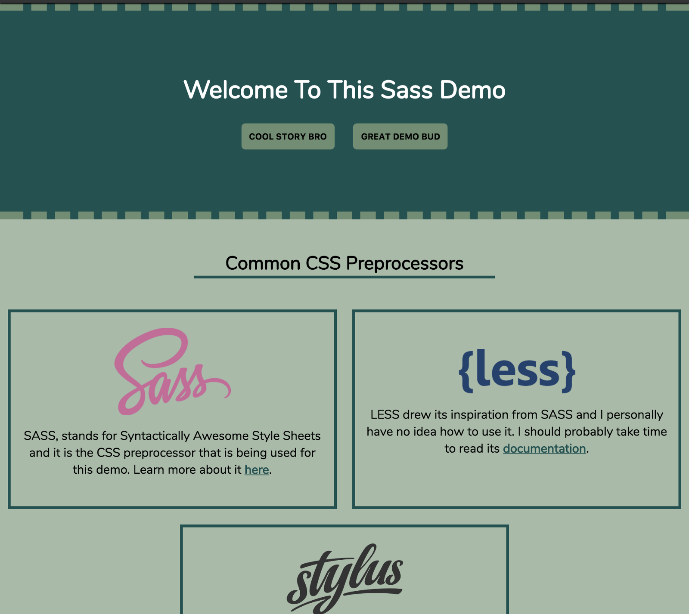
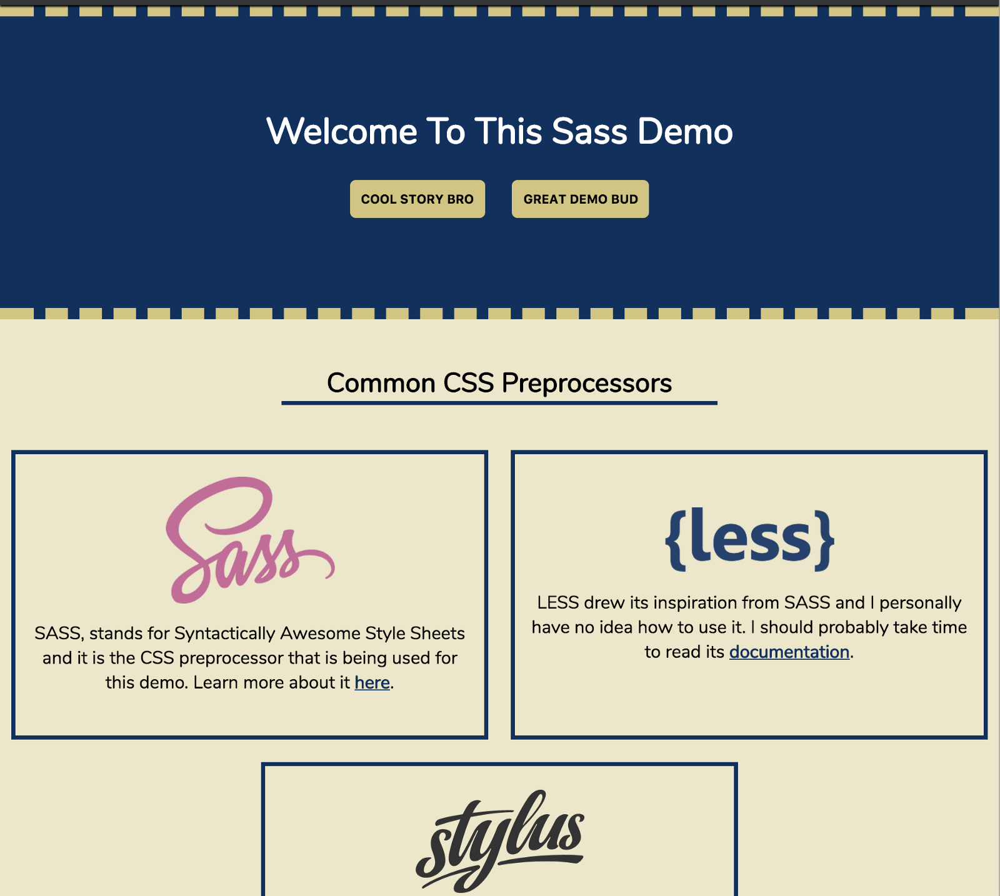
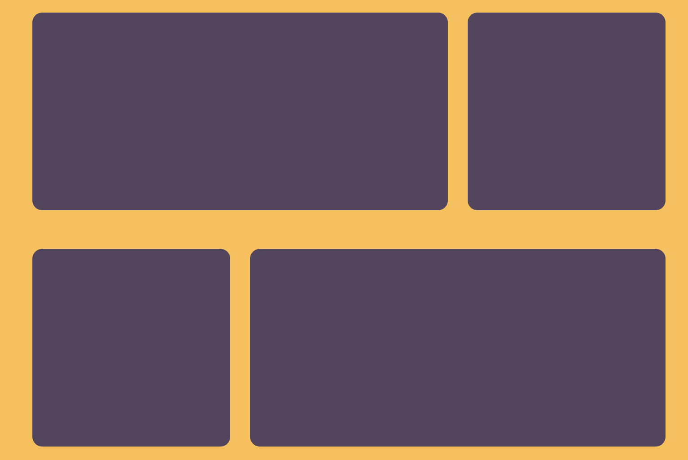
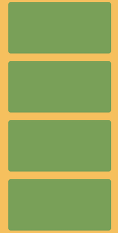

import Link from "$components/Link";

Sass is a CSS preprocessor that solves a lot of the problems with writing CSS and can be extremely useful to incorporate in your projects. I'll explain what CSS preprocessors are, how you can install Sass, the 2 different Sass syntaxes, some of the main features of Sass and finish off with some cool examples.

---

## CSS Preprocessors

CSS preprocessors allow us to use certain features that aren't currently available in CSS. The CSS specification is slowly adopting features that are currently available in preprocessors (such as <Link to="https://developers.google.com/web/updates/2016/02/css-variables-why-should-you-care">variables</Link>), but it still has a long way to go to catch up to preprocessors. CSS preprocessors allow you to **cut the lines of code** necessary for writing your CSS and it also allows you to make changes more quickly since you don't have to change repeated instances of CSS.

<p><Link to="http://sass-lang.com/">Sass</Link> is one of the most popular CSS preprocessors out there and it is widely used in a lot of applications. Sass works by writing your styles in .scss (or .sass) files, which will then get compiled into a regular CSS file. The newly compiled CSS file is what gets loaded to your browser to style your web application. This allows the browser to properly apply the styles to your web page.</p>



<span class="caption">Sass stands for <strong>S</strong>yntactically <strong>A</strong>wesome <strong>S</strong>tyle<strong>S</strong>heets</span>

Of course, Sass is not the only option when it comes to preprocessors. Two other popular options are <Link to="http://lesscss.org/">Less</Link> and <Link to="http://stylus-lang.com/">Stylus</Link>, which come with their own set of features and syntax.

## Installing and Running Sass

You can install Sass right from your terminal/command prompt. You will need to have Ruby installed on your machine in order to install Sass (comes pre-installed on Macs). Once you've got Ruby installed on your machine, you can run the following command to install Sass:

```bash
sudo gem install Sass
```

Read more about installing Sass on the Sass <Link to="http://sass-lang.com/guide">website</Link>.

There are many tools used to help compile your Sass into CSS in your projects. For example, Node.js works well with build tools such as Grunt and Gulp, which have ways to compile your Sass files. Using Grunt or Gulp allows you to specify which files to watch for changes, allowing your Sass files to be automatically compiled to CSS every time you modify and save a Sass file.


<span class="caption">Logos for both the Grunt and Gulp build tools</span>

## Sass Syntaxes

Sass has two syntaxes: Sass and Scss (AKA Sassy Sass). Scss is the newer syntax and it is an extension of the CSS syntax. This means that every valid CSS file is also a valid Scss file. The older Sass syntax uses indentation instead of brackets to nest selectors and it does not use semicolons. The older Sass syntax is not an extension of CSS.

```sass
.container
  display: block
  background-color: red
  font-family: sans-serif

ul
  list-style: none
  margin: 0

ul li
  padding: 0 10px
```

<span class="caption">Sass syntax</span>

```scss
.container {
    display: block;
    background-color: red;
    font-family: sans-serif;
}

ul {
    list-style: none;
    margin: 0;
}

ul li {
    padding: 0 10px;
}
```

<span class="caption">Sassy Sass syntax</span>

There are pros and cons to both syntaxes, as <Link to="http://thesassway.com/editorial/sass-vs-scss-which-syntax-is-better">explained here</Link>. I **prefer the newer syntax** because it is easier to convert CSS files into Sass files with the newer syntax since all CSS is valid Scss. All the examples to follow will be using the Scss syntax.


<span class="caption">Visual representation of the 2 syntaxes available in Sass (sources: <Link to="https://upload.wikimedia.org/wikipedia/commons/thumb/e/ec/Mona_Lisa%2C_by_Leonardo_da_Vinci%2C_from_C2RMF_retouched.jpg/1200px-Mona_Lisa%2C_by_Leonardo_da_Vinci%2C_from_C2RMF_retouched.jpg">left</Link> and <Link to="https://i.pinimg.com/564x/3f/b5/36/3fb53666c3eb36e76c6f8094f3e5f7f2--monna-lisa-funny-art.jpg">right</Link></span>

One easy way to familiarize yourself with Sass syntax is through CodePen, since their Pens allow you to use CSS preprocessors. You can also play around online with Sass <Link to="https://www.Sassmeister.com/">here</Link> to see how it looks like when compiled to CSS.

---

## Main Sass Features

The main features that are included in Sass are variables, nesting, partials, imports, mixins, inheritance, and operators.

### Variables

You’re able to store reusable values inside of Sass variables, such as font colors, font stacks, or border-radius values. Create variables by prepending the `$` symbol to a word of your choice. This is great when working with brand colors throughout a website.

```scss
$primary-color: #0b5351;
$secondary-color: #6b8f71;

a {
    color: $primary-color;
}

a:hover {
    color: $secondary-color;
}
```

<span class="caption">Sass variables</span>

```css
a {
    color: #0b5351;
}

a:hover {
    color: #6b8f71;
}
```

<span class="caption">Compiled CSS for the Sass example above</span>

### Nesting

Nesting your CSS selectors in Sass allows you to follow the same visual hierarchy of HTML when targeting the elements you want to style. Nesting your selectors **improves readability**, but try not to go too many levels deep since it can “over-qualify” your CSS and make your code harder to maintain. If you’re going more than 3 levels deep with your nesting, you may want to consider refactoring your code and adding classes inside of your HTML to better target your elements.

```scss
.container {
    background-color: #000;
    color: #fff;

    h1 {
        color: purple;
    }
}
```

<span class="caption">Sass nesting</span>

```css
.container {
    background-color: #000;
    color: #fff;
}

.container h1 {
    color: purple;
}
```

<span class="caption">Compiled CSS for the Sass example above</span>

### Partials

Partials allow you to modularize your Sass. Partials are files that contain Sass snippets to be included in other Sass files. Sass partials are included in other files using the `@import` directive (explained next). Partial files are named with a leading `_` such as `_button.scss` or `_carousel.scss`.

Partials are a great way to organize your Sass and can save you lots of time trying to find the correct styles to modify. This is especially true if you follow a **good file architecture**. One pattern I like to follow for my files and folders is the 7–1 pattern introduced by <Link to="https://sass-guidelin.es/">Hugo Giraudel</Link>.

```text
sass/
    |
    |– abstracts/
    |   |– _variables.scss    # Sass Variables
    |   |– _functions.scss    # Sass Functions
    |   |– _mixins.scss       # Sass Mixins
    |   |– _placeholders.scss # Sass Placeholders
    |
    |– base/
    |   |– _reset.scss        # Reset/normalize
    |   |– _typography.scss   # Typography rules
    |   …                     # Etc.
    |
    |– components/
    |   |– _buttons.scss      # Buttons
    |   |– _carousel.scss     # Carousel
    |   |– _cover.scss        # Cover
    |   |– _dropdown.scss     # Dropdown
    |   …                     # Etc.
    |
    |– layout/
    |   |– _navigation.scss   # Navigation
    |   |– _grid.scss         # Grid system
    |   |– _header.scss       # Header
    |   |– _footer.scss       # Footer
    |   |– _sidebar.scss      # Sidebar
    |   |– _forms.scss        # Forms
    |   …                     # Etc.
    |
    |– pages/
    |   |– _home.scss         # Home specific styles
    |   |– _contact.scss      # Contact specific styles
    |   …                     # Etc.
    |
    |– themes/
    |   |– _theme.scss        # Default theme
    |   |– _admin.scss        # Admin theme
    |   …                     # Etc.
    |
    |– vendors/
    |   |– _bootstrap.scss    # Bootstrap
    |   |– _jquery-ui.scss    # jQuery UI
    |   …                     # Etc.
    |
    |– main.scss              # Main Sass file
```

<span class="caption">An example of how to organize Sass files and folders in a project</span>

### Imports

CSS currently allows you to use `@import` to include other CSS files in another main CSS file. The downside of this is that it requires an additional HTTP request for each import statement, which negatively affects your web page performance.

Sass improves upon this `@import` directive by combining your Sass files prior to compiling your CSS. This allows you to output a single CSS file that will be served to the browser (i.e. one HTTP request).

Let’s say you want to import two partials (`_header.scss` and `_footer.scss`) into another file called `base.scss`(assuming they are both in the same folder). Here’s how that would like like:

```scss
header {
    display: flex;
    margin: 0;
}
```

<span class="caption"><code class="language-text">\_header.scss</code> partial</span>

```scss
footer {
    background-color: #000;
}
```

<span class="caption"><code class="language-text">\_footer.scss</code> partial</span>

```scss
@import 'header';
@import 'footer';
```

<span class="caption">Importing the above partials into <code class="language-text">\base.scss</code></span>

And your compiled CSS file would be the following:

```scss
header {
    display: flex;
    margin: 0;
}

footer {
    background-color: #000;
}
```

<span class="caption">Compiled CSS for the Sass example above</span>

### Mixins

Mixins allow you to make **groups of reusable CSS declarations** which the option of passing in arguments. When calling a mixin, you must use the `@include` statement followed by the name of the mixin. A popular use of mixins is for vendor prefixes.

```scss
@mixin border-radius($radius) {
    -webkit-border-radius: $radius;
    -moz-border-radius: $radius;
    -ms-border-radius: $radius;
    border-radius: $radius;
}

.box {
    @include border-radius(10px);
}
```

<span class="caption">Sass mixins</span>

```css
.box {
    -webkit-border-radius: 10px;
    -moz-border-radius: 10px;
    -ms-border-radius: 10px;
    border-radius: 10px;
}
```

<span class="caption">Compiled CSS for the Sass example above</span>

### Extend/Inheritance

You’re able to **share CSS properties** from one selector to another using `@extend` and it helps to reduce repetition in your code.

```scss
.message {
    padding: 0.5em;
    border-radius: 3px;
}

.message-info {
    @extend .message;
    background-color: lightblue;
}

.message-error {
    @extend .message;
    background-color: red;
}
```

<span class="caption">Sass inheritance</span>

```css
.message,
.message-info,
.message-error {
    padding: 0.5em;
    border-radius: 3px;
}

.message-info {
    background-color: lightblue;
}

.message-error {
    background-color: red;
}
```

<span class="caption">Compiled CSS for the Sass example above</span>

### Operators

The ability to do math in your CSS can be extremely beneficial and Sass includes the standard math operators `+`, `-`, `*`, `/`, and `%` that can be used in your code.

```scss
.container {
    width: 100%;
}

article[role='main'] {
    float: left;
    width: 600px / 960px * 100%;
}

aside[role='complementary'] {
    float: right;
    width: 300px / 960px * 100%;
}
```

<span class="caption">Sass operators</span>

```css
.container {
    width: 100%;
}

article[role='main'] {
    float: left;
    width: 62.5%;
}

aside[role='complementary'] {
    float: right;
    width: 31.25%;
}
```

<span class="caption">Compiled CSS for the Sass example above</span>

---

## Cool Examples

Here are four examples that demonstrate some of Sass’s features.

### Updating Color Variables

<iframe height='500' scrolling='no' title='SASS Variables' src='//codepen.io/robertcooper_rc/embed/rGdzrw/?height=500&theme-id=dark&default-tab=result' frameborder='no' allowtransparency='true' allowfullscreen='true' style='width: 100%;'></iframe>

This first example uses Sass variables to store the values for both the primary and secondary colors used in the application. The color variables are used all throughout the Sass file so changes to both those variables will result in changes to the styling of many elements on the page.



<span class="caption">Original styling of the page</span>



<span class="caption">Updated look after only changing the values of 2 color variables</span>

### Sass Dropdowns

<iframe height='400' scrolling='no' title='Sass dropdowns' src='//codepen.io/robertcooper_rc/embed/yzEGLG/?height=400&theme-id=dark&default-tab=result' frameborder='no' allowtransparency='true' allowfullscreen='true' style='width: 100%;'></iframe>

This example uses Sass variables, nesting, inheritance, and operators. Variables are used to capture color values, dimensions used for the dropdown triangles, animation values, and a standard border radius value. Inheritance is used to apply a clearfix to floated element containers. Operators are used to calculate the size of the dropdown triangles.

There are some Sass features used in this example that I did not cover above, such as the `&` selector. The `&` selector is used when referencing a parent selector. It is often used when applying styles to the hovered state of an element.

```scss
.button {
    background-color: blue;
    color: white;

    &:hover {
        background-color: lightblue;
    }
}
```

<span class="caption">Sass parent selector (&)</span>

```css
.button {
    background-color: blue;
    color: white;
}

.button:hover {
    background-color: lightblue;
}
```

<span class="caption">Compiled CSS for the Sass example above</span>

### Sass Waves

<iframe height='400' scrolling='no' title='Sass Waves' src='//codepen.io/robertcooper_rc/embed/xXzayg/?height=400&theme-id=dark&default-tab=result' frameborder='no' allowtransparency='true' allowfullscreen='true' style='width: 100%;'></iframe>

This example uses variables, operators, and a Sass “**for” loop**. The “for” loop is another feature I did not introduce above, but it is used in this example to calculate the animation of each dot in the application. This particular “for” loop saves us a lot of typing and calculations. If you look at the lines of code in the compiled CSS for this particular application, it comes out to be 121 lines of code (versus 55 lines of code using Sass).

### Sass Media Queries

<iframe height='400' scrolling='no' title='Sass Media Queries Mixin' src='//codepen.io/robertcooper_rc/embed/wrxBMy/?height=400&theme-id=dark&default-tab=result' frameborder='no' allowtransparency='true' allowfullscreen='true' style='width: 100%;'></iframe>

This final example illustrates how useful Sass mixins can be. It uses a mixin to set properties and values on selectors at specified screen widths. Depending on your browser’s width, the elements on the page will have different properties and values applied to them.


<span class="caption">On “large” widths, the boxes appear like this…</span>



<span class="caption">But if you reduce your browser’s width a bit, they look like this…</span>



<span class="caption">And if you keep reducing the width, all boxes stack like this</span>

---

I hope this article encourages some people to start using a CSS preprocessor, like Sass, in their front end development workflow. I’ve really enjoyed using it and I’m always learning about more cool thinks you can do with Sass.
