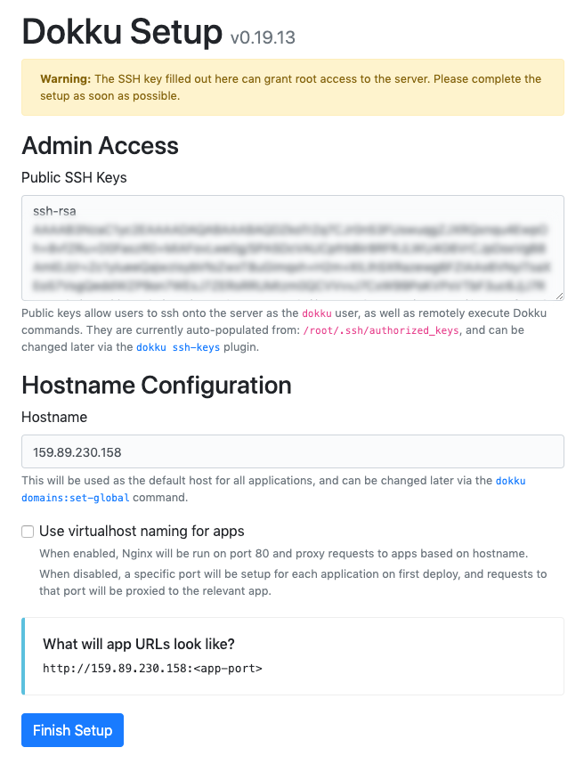

This post is going to describe the following:

- How to create a Digital Ocean Droplet and install the **latest version** of Dokku on the Droplet
- How to deploy and run a dockerized application with Dokku and have it accessible through at a domain protected with SSL
- How to setup swap space to allow for rolling updates of a dockerized app on a server with insufficient memory

## Background

I've recently been doing a lot of work with packaging web apps into docker containers and figuring out how to get everything deployed to servers. I started out deploying my dockerized apps to AWS [EC2](https://aws.amazon.com/ec2/) servers (using [ECS](https://aws.amazon.com/ecs/) to allow for rolling updates), but it was too expensive to justify. Instead of AWS, I've migrated my web app to [Digital Ocean Droplets](https://www.digitalocean.com/products/droplets/) which only cost $5/month. In order to manage the dockerized apps on the Droplets, i'm using [Dokku](https://github.com/dokku/dokku).

## Create a Digital Ocean Droplet

Create a Digital Ocean droplet with the following configuration:

- Ubuntu 18.04
- Standard plan - $5/month (1 GB Memory / 1 GB CPU / 25 GB SSD / 1000 GB transfer)
- Datacenter location closest to you
- SSH key authentication
- Hostname that is relevant to the app you want to deploy

## Install Dokku

Digital Ocean allows you to create a droplet with [Dokku pre-installed](https://marketplace.digitalocean.com/apps/dokku), but it won't be the latest version of Dokku. I prefer to use the latest version of Dokku in order to have all of its latest features.

> At the time of writing, the latest version of Dokku is 0.19.13. The installation steps below may differ for newer versions. It might be worth double checking the below instructions with the Dokku install guide [here](http://dokku.viewdocs.io/dokku/getting-started/installation/).

SSH into your Digital Ocean server using the IP address of the droplet. In this example, the IP address is 159.89.230.158.

```bash
ssh root@159.89.230.158
```

Once in the server, download and run the Dokku installation script.

```bash
wget [https://raw.githubusercontent.com/dokku/dokku/v0.19.13/bootstrap.sh](https://raw.githubusercontent.com/dokku/dokku/v0.19.13/bootstrap.sh;)
sudo DOKKU_TAG=v0.19.13 bash bootstrap.sh
```

> Notice that a variable named `DOKKU_TAG` is passed to the script. Make sure to set the value to the latest version of Dokku.

Once the script has completed, delete the script from the server.

```bash
rm bootstrap.sh
```

In a browser, visit the droplet's IP address to finalize the setup of Dokku. Your public SSH key should be displayed in the textarea. For the hostname configuration, use the the droplet IP address and leave the "*Use virtualhost naming for apps*" checkbox unchecked.


<span class="caption">The configuration screen for Dokku found in a browser at the Droplet's IP address.</span>

The configuration screen for Dokku found in a browser at the Droplet's IP address.

## Deploy an application

On the server, create a Dokku app. In this case, the app is being named "frontend".

```bash
dokku apps:create frontend
```

Outside of the Droplet and on your local machine, build the docker image of the app that should run on the droplet. In this case, [Docker Compose](https://docs.docker.com/compose/) is being used to build the docker image.

```bash
docker-compose build frontend
```

Once the docker image is built, there are two approaches for getting the docker image onto the Droplet.

- Option 1: Upload the docker image directly onto your server
- Option 2: Upload the image to a container registry and then pull the image from the container registry to the Droplet.

I've had issues trying to upload large docker images directly to the server using option 1, so opt for option 2 if you find yourself in a similar situation.

### Option 1: Upload image directly to server

First, make sure to tag the image you've just built to follow the naming convention required by Dokku. The naming convention takes the form of **dokku/[dokku-app-name]:[version]**. In this example, the locally built docker image is currently tagged as `app/frontend`.

```bash
docker tag app/frontend:latest dokku/frontend:latest
```

Now, upload the image to the server. This can take a few minutes, depending on the size of your docker image.

```bash
docker save dokku/frontend:latest | bzip2 | ssh root@159.89.230.158 "bunzip2 | docker load"
```

### Option 2: Upload image to container registry and download image onto server

It's common to have docker images uploaded to a container registry during a CI/CD flows. The most popular container registry is probably [Docker Hub](https://hub.docker.com/). For this tutorial, [AWS ECR](https://aws.amazon.com/ecr/) is used as the container registry (they offer good pricing for private images). Therefore the following steps will outline how to upload images to ECR and pull those images to a Droplet.

Tag the local docker image to the name of the container repository on ECR. Replace the variables in square brackets with the appropriate values for the ECR repository of interest.

```bash
docker tag app/frontend:latest [**aws_account_id**].dkr.ecr.[**region**].amazonaws.com/[**repository-name**]:latest
```

Push the tagged image to ECR.

```bash
docker push [**aws_account_id**].dkr.ecr.[**region**].amazonaws.com/[**repository-name**]:latest
```

> If the above two steps are unclear, read the [AWS documentation](https://docs.aws.amazon.com/AmazonECR/latest/userguide/docker-push-ecr-image.html) on how to push an image to ECR.

SSH into the server and install the AWS CLI (official instructions [found here](https://docs.aws.amazon.com/cli/latest/userguide/install-cliv2-linux.html)). The AWS CLI is required in order to authenticate with AWS and pull images from ECR.

```bash
curl "https://awscli.amazonaws.com/awscli-exe-linux-x86_64.zip" -o "awscliv2.zip" # Downloads the AWS CLI installation script
apt install unzip # Installs an unzip tool
unzip awscliv2.zip # Unzip the AWS CLI installation script
sudo ./aws/install # Runs the AWS CLI installation script
rm -r aws && rm awscliv2.zip # Remove the installation files
```

Configure the AWS CLI by running `aws configure`. Supply the command with AWS credentials and the region of the ECR repository. If the AWS CLI has previously been configured on a local machine, then the the AWS credentials can be found in the `~/.aws/credentials` file.

Login to the ECR repository.

```bash
aws ecr get-login-password | docker login --username AWS --password-stdin [**aws_account_id**].dkr.ecr.[**region**].amazonaws.com
```

Pull the latest image from the ECR repository.

```bash
docker pull [**aws_account_id**].dkr.ecr.[**region**].amazonaws.com/[**repository-name**]:latest
```

Tag docker image as **dokku/[dokku-app-name]:[version]**, which is the required naming convention for Dokku in order to be able to deploy the app.

```bash
docker tag [**aws_account_id**].dkr.ecr.[**region**].amazonaws.com/[**repository-name**]:latest dokku/frontend:latest
```

---

Now that the docker image is on the the server and tagged in such a way to be recognized by Dokku, it is now possible to deploy the application. Verify that Dokku has the tagged image for your app.

```bash
dokku tags frontend
```

The tagged image should be displayed in the output.

```
REPOSITORY          TAG                 IMAGE ID            CREATED             SIZE
dokku/frontend      latest              97b6f8d77e2e        5 minutes ago       1.59GB
```

Deploy the image.

```bash
dokku tags:deploy frontend latest
```

In order for the app to be accessible through the web, the server needs to map port 80 to the port of the deployed application container. For this example, the deployed app is running on port 3000, therefore the following command will map port 80 to 3000:

```bash
dokku proxy:ports-set frontend http:80:3000
```

> The port of the deployed app is determined by the port specified in the [EXPOSE](https://docs.docker.com/engine/reference/builder/#expose) instruction in the app's Dockerfile. If a port is not specified through an EXPOSE instruction, Dokku will expose the app to port 5000 by default.

Verify the site is live by visiting the app in a browser at the server's IP address.

## Setup application domain name

Next, configure a domain to point towards site. For this example, the domain of *[my-frontend-app.com](http://my-frontend-app.com)* will be used.

```bash
dokku domains:set frontend my-frontend-app.com
```

Make sure to setup an A record on the domains DNS to point towards the server's IP address. Once the A record is successfully pointing to the server, the app should be accessible in a browser at that domain name.

## Enable SSL on domain name

It is now possible to enable SSL on the domain using the [Dokku Let's Encrypt](https://github.com/dokku/dokku-letsencrypt) plugin. Install the dokku plugin, configure the email to use for the Let's Encrypt certificate, and then attach an SSL certificate to the application.

```bash
sudo dokku plugin:install [https://github.com/dokku/dokku-letsencrypt.git](https://github.com/dokku/dokku-letsencrypt.git)
dokku config:set --no-restart frontend DOKKU_LETSENCRYPT_EMAIL=name@email.com
dokku letsencrypt frontend
```

## Rolling updates

When it comes time to update the deployed application, a new image will need added to the server using option 1 or 2 outlined above. Once the images are on the server, the `dokku tags:deploy` command can be run, which will do what is called a "rolling update". This means a new docker container will be spun up to replace the existing docker container. In order to switch the docker containers without having any down time, the server must have enough resources (i.e. memory) to handle running 2 docker containers at once.

If there is insufficient memory on the server to allow for 2 docker containers to run at the same time, the deploy will fail and it could bring down your server. To get around this, the server should be upgraded with more memory (which means more $$) or the server can be configure with swap space. For more details on swap space and how to configure it on a digital ocean server, see [this guide](https://www.digitalocean.com/community/tutorials/how-to-add-swap-space-on-ubuntu-18-04). The linked guide outlines the commands needed to setup swap space, and those are summarized below.

```bash
sudo fallocate -l 1G /swapfile
sudo chmod 600 /swapfile
sudo mkswap /swapfile
sudo swapon /swapfile
sudo sysctl vm.swappiness=10
sudo sysctl vm.vfs_cache_pressure=50
sudo vi /etc/sysctl.conf
# Add the following to lines with vim to the bottom of the sysctl.conf file
# vm.swappiness=10
# vm.vfs_cache_pressure=50
sudo printf "vm.swappiness=10\nvm.vfs_cache_pressure=50" >> /etc/sysctl.conf
```

## Miscellaneous

### Dokku help

To see the set of available dokku commands, just use execute the `dokku` command and the available commands will be outputted to the console. Of course, there is always the [official dokku documentation](http://dokku.viewdocs.io/dokku/) for more information.

### Removing old docker images from server

Because the server has a limited amount of disk space, it's a good idea to clear out unused docker images that will accumulate on the server. For example, every time the latest version of a docker image is pulled on a server, the older version will be given a version of `none`. These docker images can safely be deleted using the following command.

```bash
docker images | grep none | awk '{ print $3; }' | xargs docker rmi -f
```

### Database setup on server using Dokku

Dokku [has plugins](https://github.com/dokku/dokku/blob/master/docs/community/plugins.md) that allow you to easily setup databases on your server and connecting them to your Dokku app. For example, I'm using the [dokku mysql](https://github.com/dokku/dokku-mysql) plugin on one of my Droplets.

## Related Resources

[Deploying a Typescript Server to Digital Ocean with Dokku](https://www.youtube.com/watch?v=AdHwBKKQHZ4) - Ben Awad

[Building a Continuous Integration & Deployment Pipeline Using Docker (CI/CD)](https://www.taniarascia.com/continuous-integration-pipeline-docker/) - Tania Rascia