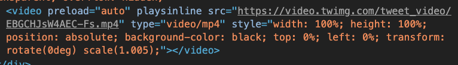
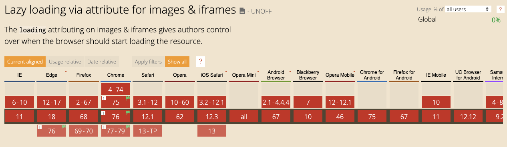
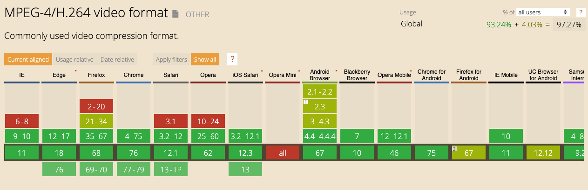
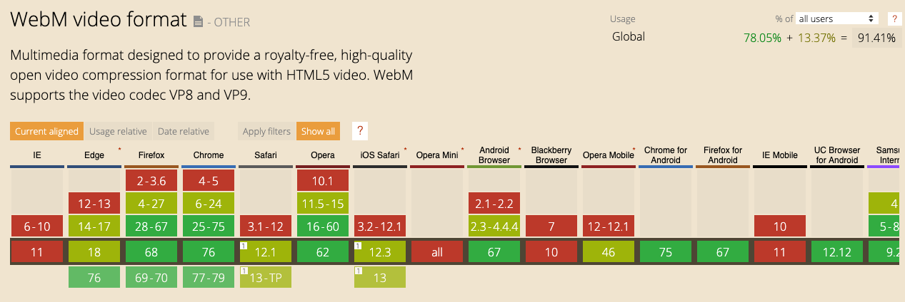

import VideoComparison from "./VideoComparison";


GIFs are an omnipresent part of the internet. They are used on Twitter as a way to react to something, they are used in blog posts to make them more interesting, and they are used for the majority of conversations amongst coworkers on Slack (or maybe that's just me?). With that being said, GIFs are not good for the web.

GIFs are not optimized to be used on the web: their file size is very large and decoding GIFs in the browser is not a very performant operation. However, there is a better alternative to using GIFs and that alternative is to use videos instead.

Video files are much smaller than GIFs and they are more easily decoded in the browsers compared to GIFs. Actually, when you post a GIF on Twitter, Twitter converts the GIF into a video, which dramatically reduces the file size. This is something very important for Twitter, where users may encounter many GIFs while scrolling their timeline (which translates to more data being downloaded on a user's phone). By reducing the amount of data a user needs to download to view content, they are able to load assets faster as well as use less mobile data (which can be very expensive, especially for us [Canadians](https://nationalpost.com/news/canada/why-canadian-cell-phone-bills-are-among-the-most-expensive-on-the-planet)).

> Currently, the best article i've found on replacing GIFs with videos is [this Google Web Fundamentals article](https://developers.google.com/web/fundamentals/performance/optimizing-content-efficiency/replace-animated-gifs-with-video/) that I suggest you read if you're interested in all this.

## Evaluating GIFs in existing web apps

Because Twitter does GIF optimizations, I was curious to see if other web apps also tried to optimized GIFs that are uploaded to their app. As an experiment i've taken a GIF of Fogel from [Superbad](<https://en.wikipedia.org/wiki/Superbad_(film)>) and uploaded it on three web apps to see how each app handles GIFs and analyze the final file size of the optimized GIFs. The three web apps i've looked at are Twitter, Dev Community, and Medium.

<Video src="/mclovin" />
<span class="caption">GIF used to test how existing web apps optimize uploaded GIFs.</span>

As a reference, the size of the above raw GIF used for this experiment is 1.0 MB.

### Twitter

As mentioned earlier, [Twitter](https://twitter.com) converts GIF files to video files (specifically MPEG4).


<span class="caption">HTML video element corresponding to the upload GIF of Fogel.</span>


<span class="caption">MPEG4 file size of 58.7 KB and load time of 49 ms.</span>

Twitter reduces the size of the original GIF asset by 94% by converting it to a MPEG4 file!

### Medium

On [Medium](https://medium.com), you have to ability to upload GIFs to the articles you write. As it turns out, Medium doesn't do any sort of optimizations for the uploaded GIFs:


<span class="caption">HTML image element corresponding to the upload GIF of Fogel.</span>


<span class="caption">GIF file size of 1.0 MB and load time of 485 ms.</span>

The original files ize of the GIF remains unchanged and the load time for the GIF is around 10 times the load time of the MPEG4 file that Twitter uses. That being said, Medium does do a cool optimization where they show a very blurred image of your GIF until it has fully loaded the GIF, so that the user can at least see something while waiting for the GIF to load.

### Dev Community

The [Dev Community](https://dev.to), just like Medium, doesn't optimize uploaded GIFs for articles written on the platform.


<span class="caption">HTML image element corresponding to the upload GIF of Fogel.</span>


<span class="caption">GIF file size of 1.0 MB and load time of 386 ms.</span>

Again, the original file size of the GIF remains unchanged, but the load time is faster compared to Medium (386 ms vs 485 ms). Not sure why this is, but the load time of an asset depends on many factors, network speed being one of them.

One interesting thing to point out is that the Dev Community [uses the `loading="lazy"`](https://addyosmani.com/blog/lazy-loading/) attribute on their `` elements. This allows for the GIF to only be loaded when a user scrolls near it. However, at the time of writing, the `loading` attribute is only currently supported in the latest version of chrome, and can only be enabled through a [feature flag](https://www.howtogeek.com/104631/find-hidden-features-on-chromes-internal-chrome-pages/).


<span class="caption">Support for the <code>loading</code> attribute on <code>img</code> elements at the time of writing (<Link to="https://caniuse.com/#feat=loading-lazy-attr">See current support here</Link>).</span>

One other thing that I've noticed with the Dev Community is that they are using [Cloudinary](https://cloudinary.com) as a CDN for their image and video assets (notice the URL of the GIF source in the HTML `` element). Because they are using Cloudinary, the Dev Community could take advantage of Cloudinary's ability to [use lossy compression to compress](https://cloudinary.com/blog/lossy_compression_for_optimizing_animated_gifs) any uploaded GIF assets and reduce the file size by around 50% without losing too much quality. Even better, Cloudinary can [automatically convert GIFs to WebM and/or MPEG4 videos](https://cloudinary.com/blog/reduce_size_of_animated_gifs_automatically_convert_to_webm_and_mp4) which will result in even more savings in file size compared to the lossy GIF compression.

## Best video format

There are 2 video formats that are popular choices for videos on the web: WebM and MPEG4. MPEG4 is the format that's been around for the longest [since around 1999](https://en.wikipedia.org/wiki/MPEG-4#MPEG-4_Parts) and enjoys great browser support. As shown above, Twitter uses MPEG4 videos to replace GIFs. WebM has been [around since 2010](https://github.com/webmproject/libvpx/releases/tag/v0.9.0) and has a slight advantage over MPEG4 in that it can achieve equal quality video at a smaller file size compared to MPEG4. Unfortunately, WebM video browser support isn't as good as that of MPEG4.


<span class="caption">Browser support for MPEG4 videos at the time of writing (<Link to="https://caniuse.com/#feat=mpeg4">See current support here</Link>).</span>


<span class="caption">Browser support for WebM videos at the time of writing (<Link to="https://caniuse.com/#feat=webm">See current support here</Link>).</span>

## Converting GIFs to WebM and MPEG4 using ffmpeg

[ffmpeg](https://ffmpeg.org) is a free command line tool that can be used to convert GIFs into WebM or MPEG4 video files. You can do a lot of audio and video manipulations with ffmpeg, but I will admit that knowing the right commands to use is not obvious when reading their documentation or if you are new to audio/video-specific terminology.

In order to run any ffmpeg command, you'll need to [first install it on your machine](https://ffmpeg.org/download.html).

Personally, what I end up doing is that I convert a .gif file (or .mov if I do a screen recording on my mac) into both a .webm and .mp4 file. Specifically, the two commands that I use are the following:

**Convert .gif to .webm**

```
ffmpeg -i input-name.gif -c:v libvpx-vp9 -b:v 0 -crf 40 output-name.webm
```

`-i input-name.gif` -> Specify the input file
`-c:v libvpx-vp9` -> Selects the [VP9 webm video encoder](https://trac.ffmpeg.org/wiki/Encode/VP9)
`-b:v 0` -> Specify a [bitrate](https://trac.ffmpeg.org/wiki/Limiting%20the%20output%20bitrate) of 0 to enable ["Constant Quality"](https://trac.ffmpeg.org/wiki/Encode/VP9#constantq) mode.
`-crf 40` -> Specify the video quality to be used. A lower number corresponds with a higher quality video, but also a larger file size.

**Convert .gif to .mp4**

```
ffmpeg -i input-name.gif -b:v 0 -crf 25 output.mp4
```

`-i input-name.gif` -> Specify the input file.
`-b:v 0` -> Specify a bitrate of 0 to enable ["Constant Rate Factor"](https://trac.ffmpeg.org/wiki/Encode/H.264#crf) mode for the MPEG4 encoder.
`-crf 25` -> Specify the video quality to be used. A lower number corresponds with a higher quality video, but also a larger file size.

Notice how the `-crf` value passed to the MPEG4 command is lower than that of the value passed to the WebM command, which might make you think you're getting a higher quality video with MPEG4. However, since we're using different encoders between both WebM and MPEG4 conversions, the `-crf` values are not comparable. You need to evaluate quality by watching the outputted video.

When converting the Fogel GIF that I used earlier in the article to WebM and MPEG4 using the above commands, I get a WebM file size of 59 KB and and MPEG4 file size of 105 KB. To demonstrate the visual quality of both videos, i've added them below, with the WebM video first and the MPEG4 video second. Of course, if you're viewing the WebM video on an unsupported browser, it sadly won't work for you.

<VideoComparison/>

## Adding videos to HTML

You can add videos to your HTML using the [`<video>` element](https://developer.mozilla.org/en-US/docs/Web/HTML/Element/video) along with nested [`<source>` elements](https://developer.mozilla.org/en-US/docs/Web/HTML/Element/source). What's cool is that you can add multiple sources inside your `<video>` element in order to specify fallback videos in case a particular video type is not supported. For example, if we want to use WebM videos for browsers that support WebM and MPEG4 videos for browsers that don't support WebM, we could use the following markup:

```html
<video>
    <source src="my-video.webm" type="video/webm" />
    <source src="my-video.mp4" type="video/mp4" />
</video>
```

Furthermore, if you'd like to have the video behave similarly to a GIF by having it autoplay and infinitely loop, you can add the boolean attributes `autoplay`, `loop`, `muted`, and `playsinline` to the `<video>` element.

```html
<video autoplay loop muted playsinline>
    <source src="my-video.webm" type="video/webm" />
    <source src="my-video.mp4" type="video/mp4" />
</video>
```

---

As you can see, GIFs are ill-suited for usage on the web, but videos can replace them. Of course, it does take some work on the developers side in order to convert GIFs to videos, but that can result in a meaningful impact to end users. As alluded to earlier, there are some tools that can help automate the conversion of GIFs to videos, by using services such as [Cloudinary](https://cloudinary.com) to host your image and video assets.
