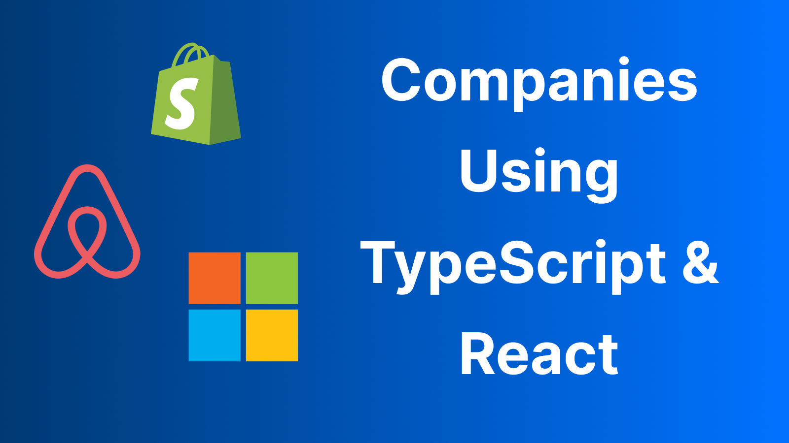
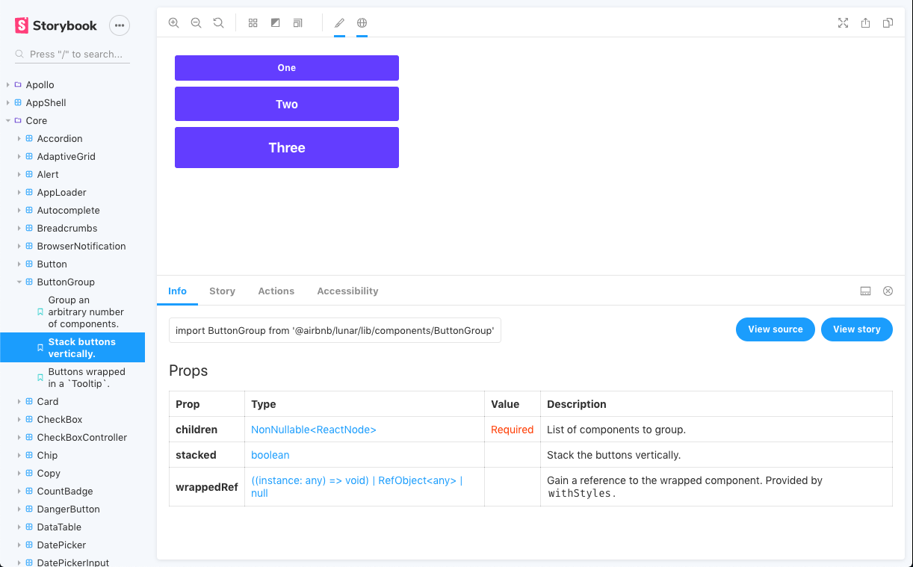
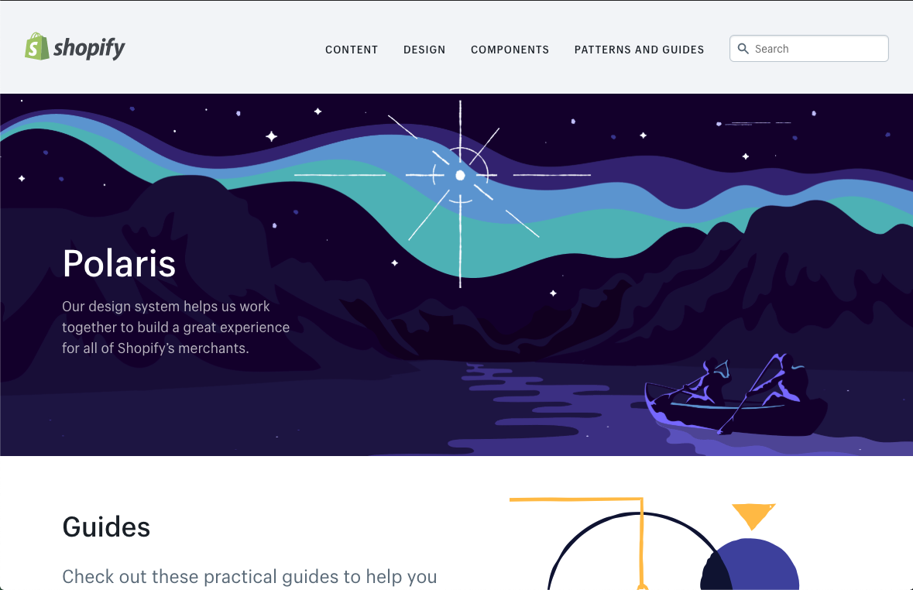
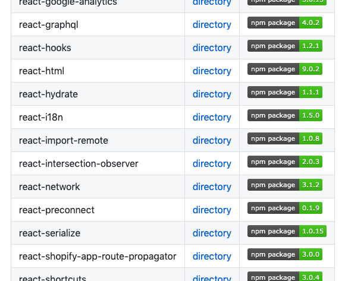
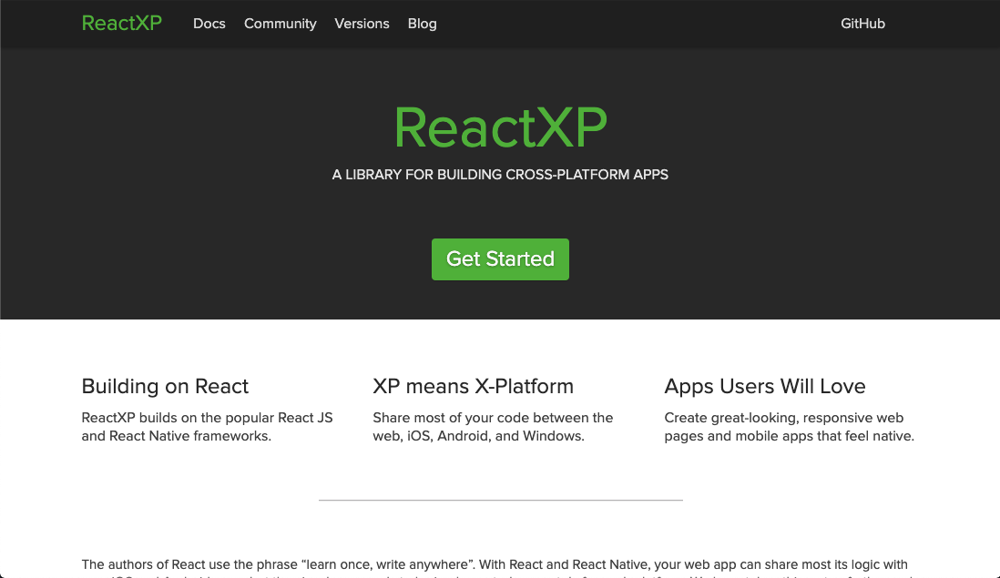

import GithubButton from 'components/mdx/GithubButton';



This article lists some open source projects maintained by some popular tech companies that use both TypeScript and React.

## Airbnb

### Lunar



> React toolkit and design language for Airbnb open source and internal projects

The Lunar repo is a mono repo that holds many packages related to Airbnb's design language. Their [core package](https://github.com/airbnb/lunar/tree/master/packages/core) includes close to 100 React components used as building blocks in other packages. To view all the components, you need to pull down the repository in order to run their [Storybook](https://storybook.js.org/), where you can then explore all their base components.

<GithubButton text="View the repo" link="https://github.com/airbnb/luna" />

## Shopify

### Polaris React



> Shopify’s product component library

Polaris React contains a set of React components that are part of Shopify's [Polaris design system](https://polaris.shopify.com/).

<GithubButton text="View the repo" link="https://github.com/Shopify/polaris-react" />

### Quilt



> A loosely related set of packages for JavaScript / TypeScript projects at Shopify

A monorepo that exports many utility packages, from jest test utilities to custom React hooks.

As an example, here is their `useTimeout` React hook which calls a callback function after a certain delay (using `setTimeout`) and also takes care of clearing the timeout when a component unmounts:

```tsx
import * as React from 'react';

export default function useTimeout(callback: () => void, delay: number) {
    React.useEffect(() => {
        const id = setTimeout(callback, delay);
        return () => clearTimeout(id);
    }, [callback, delay]);
}
```

<GithubButton text="View the repo" link="https://github.com/Shopify/quilt" />

## Microsoft

### ReactXP



> Library for cross-platform app development

ReactXP (which stands for React cross-platform), is a library that provides a layer of abstraction over React and React Native in order to allow code to be reused between iOS, android, and Windows applications (notice how they totally shafted MacOS from the list of supported platforms). Check out their [Hello World example](https://github.com/microsoft/reactxp/tree/master/samples/hello-world) for a sample implementation of ReactXP.

<GithubButton text="View the repo" link="https://github.com/microsoft/reactxp" />

### Bot Framework Emulator


> The Bot Framework Emulator is a desktop application that allows bot developers to test and debug bots built using the [Bot Framework SDK](https://github.com/microsoft/botframework-sdk)

Microsoft provides [an SDK](https://github.com/microsoft/botframework-sdk) to write some bots and they've also created an emulator that allows users to test out bots created through their SDK.

<GithubButton text="View the repo" link="https://github.com/microsoft/BotFramework-Emulator" />

---

As you can see, I wasn't able to find too many tech companies that have TypeScript & React open source projects. If you find any more, [let me know on Twitter](https://twitter.com/RobertCooper_RC) and I'll add them to the list.
