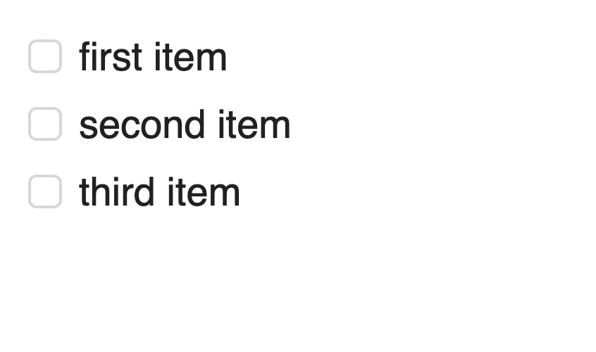
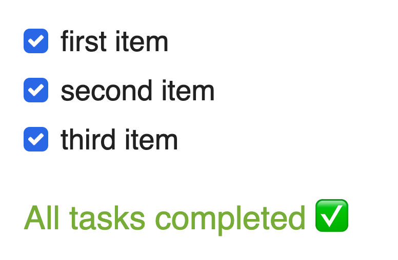

import GithubButton from 'components/mdx/GithubButton';
import Quote from "$components/Quote";


With the introduction of React Hooks, there is more of an incentive to write function components in React since there is no longer a need use classes when building components. When it comes to testing React components, there are two popular libraries that are often reached for: [enzyme](https://github.com/airbnb/enzyme) and [react-testing-library](https://github.com/kentcdodds/react-testing-library). I used to always reach for enzyme when testing my react components, but I've recently made the switch to react-testing-library because the react-testing-library API encourages tests that are completely ignorant of implementation details. Why is this good? Testing implementation details [can lead to both false negatives and false positives](https://kentcdodds.com/blog/testing-implementation-details), which make tests much more unreliable.

In this post, I'll look at an example stateful function component that is tested with react-testing-library. I'll also write the same component into its class component equivalent and show how the class component can be tested with enzyme.

## Checklist Example

Here's a checklist component that allows a user to check off items and display a message after all the items have been checked.

<Quote>Note: All these examples are written in TypeScript.</Quote>

```ts
export const Checklist = ({ items }: ChecklistProps) => {
    const [checklistItems, setChecklistItems] = useState(items);

    const handleClick = (itemIndex: number) => {
        const toggledItem = { ...checklistItems[itemIndex] };
        toggledItem.completed = !toggledItem.completed;
        setChecklistItems([...checklistItems.slice(0, itemIndex), toggledItem, ...checklistItems.slice(itemIndex + 1)]);
    };

    // Determine if all tasks are completed
    const allTasksCompleted = checklistItems.every(({ completed }) => completed);

    return (
        <div>
            <form>
                {checklistItems.map((item, index) => (
                    <React.Fragment key={item.description}>
                        <input
                            onChange={() => handleClick(index)}
                            type="checkbox"
                            className="checkbox"
                            checked={item.completed ? true : false}
                            id={item.description}
                        />
                        <label htmlFor={item.description}>{item.description}</label>
                    </React.Fragment>
                ))}
            </form>
            <TasksCompletedMessage className="xs-text-4 text-green xs-mt2" visible={allTasksCompleted}>
                All tasks completed{' '}
                <span role="img" aria-label="checkmark">
                    ✅
                </span>
            </TasksCompletedMessage>
        </div>
    );
};
```

Here's what the component would look like when used:


<span class="caption">Checklist with two unchecked items.</span>


<span class="caption">Checklist with two checked items and a message indicating all items are checked.</span>

Now when I'm thinking of testing this component, I want to make sure that a user is able to properly select a checkbox and also display the completed message when all the items have been checked. Here's how these tests would look like when written with react-testing-library:

```ts
afterEach(cleanup);

const mockItems = [
    {
        description: 'first item',
        completed: false,
    },
    {
        description: 'second item',
        completed: false,
    },
    {
        description: 'third item',
        completed: false,
    },
];

describe('Checklist', () => {
    it('should check two out the three checklist items', () => {
        const { getByText, getByLabelText } = render(<Checklist items={mockItems} />);

        fireEvent.click(getByText('first item'));
        fireEvent.click(getByText('second item'));

        expect(getByLabelText('first item').checked).toBe(true);
        expect(getByLabelText('second item').checked).toBe(true);
        expect(getByLabelText('third item').checked).toBe(false);
        expect(getByText('All tasks completed')).not.toBeVisible();
    });

    it('should display a message when all items are completed', () => {
        const { getByText, getByLabelText } = render(<Checklist items={mockItems} />);

        fireEvent.click(getByText('first item'));
        fireEvent.click(getByText('second item'));
        fireEvent.click(getByText('third item'));

        expect(getByLabelText('first item').checked).toBe(true);
        expect(getByLabelText('second item').checked).toBe(true);
        expect(getByLabelText('third item').checked).toBe(true);
        expect(getByText('All tasks completed')).toBeVisible();
    });
});
```

There are a few special things of note in these tests. The first being how we are targeting elements on the page by their text rather than by a class name, id, or other [DOM selector](https://developer.mozilla.org/en-US/docs/Web/API/Document_object_model/Locating_DOM_elements_using_selectors#Selectors). This is important because this is actually how a user will find an element on the page. A user doesn't see or care about what classes or ids are found on an element so it's unrealistic to expect a user to find and interact with an element on a page based on a DOM selector.

react-testing-library doesn't only allow you to target elements by text, but you can also target elements through labels, placeholder text, alt text, title, display value, role, and test id ([see the documentation](https://testing-library.com/docs/dom-testing-library/api-queries#bylabeltext) for details on each of these methods of targeting elements).

Another important thing to notice in these tests is that we aren't looking at the value for the internal component state, nor are we testing any of the functions being used within the component itself. Basically what this means is that we **don't care about testing the implementation** details of our component, but we are more interested in testing how the component will **actually be used by a user**. Actually, it's extremely difficult to test implementation details of a function component since it's not possible to access the component state, nor can we access any of the functions/methods that are defined and used inside of the component. However, as a fun exercise, let's look at our checklist component written in as a class component:

```ts
export class Checklist extends React.Component<ChecklistProps, ChecklistState> {
    state = {
        checklistItems: this.props.items,
    };

    handleChange = (itemIndex: number) => {
        const toggledItem = { ...this.state.checklistItems[itemIndex] };
        toggledItem.completed = !toggledItem.completed;
        this.setState({
            checklistItems: [
                ...this.state.checklistItems.slice(0, itemIndex),
                toggledItem,
                ...this.state.checklistItems.slice(itemIndex + 1),
            ],
        });
    };

    render() {
        // Determine if all tasks are completed
        const allTasksCompleted = this.state.checklistItems.every(({ completed }) => completed);
        return (
            <div>
                <form>
                    {this.state.checklistItems.map((item, index) => (
                        <React.Fragment key={item.description}>
                            <input
                                onChange={() => this.handleChange(index)}
                                type="checkbox"
                                className="checkbox"
                                checked={item.completed ? true : false}
                                id={item.description}
                            />
                            <label htmlFor={item.description}>{item.description}</label>
                        </React.Fragment>
                    ))}
                </form>
                <TasksCompletedMessage className="xs-text-4 text-green xs-mt2" visible={allTasksCompleted}>
                    All tasks completed{' '}
                    <span role="img" aria-label="checkmark">
                        ✅
                    </span>
                </TasksCompletedMessage>
            </div>
        );
    }
}
```

Now, let's use enzyme to test our checklist class component. However, this time we will be testing the implementation details of our component.

```ts
const mockItems = [
    {
        description: 'first item',
        completed: false,
    },
    {
        description: 'second item',
        completed: false,
    },
    {
        description: 'third item',
        completed: false,
    },
];

describe('Checklist Class Component', () => {
    it('should render all 3 list items', () => {
        const wrapper = mount(<Checklist items={mockItems} />);

        expect(wrapper.find('label').length).toBe(3);
    });

    describe('handleChange', () => {
        it('should check two out the three checklist items', () => {
            const wrapper = mount(<Checklist items={mockItems} />);
            const instance = wrapper.instance();

            instance.handleChange(0);
            instance.handleChange(1);

            expect(wrapper.state('checklistItems')).toEqual([
                {
                    description: 'first item',
                    completed: true,
                },
                {
                    description: 'second item',
                    completed: true,
                },
                {
                    description: 'third item',
                    completed: false,
                },
            ]);
        });

        it('should display a message when all items are completed', () => {
            const wrapper = mount(<Checklist items={mockItems} />);
            const instance = wrapper.instance();

            instance.handleChange(0);
            instance.handleChange(1);
            instance.handleChange(2);
            wrapper.update();

            expect(
                wrapper
                    .find('.text-green')
                    .first()
                    .props().visible,
            ).toBe(true);
        });
    });
});
```

Because the enzyme API makes available a component's [state](https://airbnb.io/enzyme/docs/api/ReactWrapper/state.html) as well as the class methods of component (by accessing the [component's instance](https://airbnb.io/enzyme/docs/api/ReactWrapper/instance.html)), we are now able to test both those things. For example, looking at the test labelled `should check two out the three checklist items`, the `handleChange` method is triggered twice (which should happen when a user clicks two checklist items) and then the value of the state is checked to make sure it has updated appropriately. The problem with this test is that we aren't testing how this component is actually being used. The user doesn't care about the value of a component's internal state or if a function has been called. All a user cares about (in this case) is that they are able to click on two checklist items and that both those checklist items appear as checked to them.

Enzyme's API doesn't allow for an element to be find by it's text, it only allows for elements to be selected based on a CSS selector, React component constructor, React component display name, or based on a component's props ([see here](https://airbnb.io/enzyme/docs/api/selector.html) for details on Enzyme selectors). Because Enzyme's API basically pushes you to test implementation details for a component, I prefer to stay away from Enzyme and instead use react-testing-library.

## Refactoring Class Components to Function Components

Another advantage of using react-testing-library and not testing for implementation details is that you can easily refactor your class component to a function component without having the also refactor your tests. Think about it, if you're targeting class methods in your tests, those methods will no longer be available when it's being implemented within a function component.

## Demo Repository

I've setup a demo repository, that contains the above example with the checklist and I've also created another example for a component named `SelectTwo`, which is a list of items that only allows for 2 items to be selected at once.

<GithubButton link='https://github.com/robertcoopercode/testing-react-components-demo' text='View the repo'/>

## Other Ressources

Here are some great ressources that you should check out if you're interested in learning more about react-testing-library.

-   [The main Github repo for react-testing-library](https://github.com/kentcdodds/react-testing-library)
-   [The official documentation for react-testing-library](https://testing-library.com/docs/react-testing-library/intro)
-   [This Youtube video by Level Up Tutorials explaining the advantages of react-testing-library](https://www.youtube.com/watch?v=JKOwJUM4_RM&feature=youtu.be)
