import Link from "$components/Link";

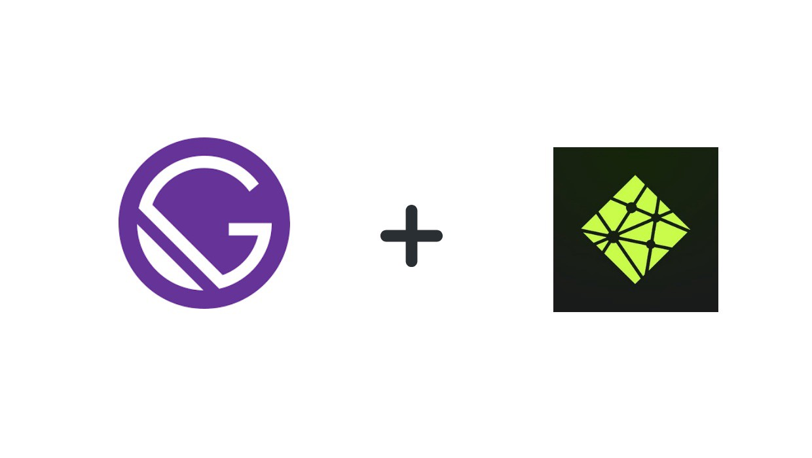

The <Link to="https://jamstack.org/">JAMStack</Link> is becoming more and more common for building out websites due to its better performance, low cost, high security, and positive developer experience.

A great solution to building a site using the JAMStack is to use Gatsby along with Netlify CMS. This post explains what the JAMStack is, how Gatsby and Netlify CMS work and provides a walkthrough for a web app built with Gatsby and Netlify CMS.

## What is the JAMStack?

The <Link to="https://jamstack.org/">JAMStack</Link> refers to a web application that has no server-side component to it, but rather relies on templated **markup** files which are requested through an **API** by client-side **JavaScript** to render content on a page. All of the templated markup is generated prior to deployment so there is no waiting for pages to be built on the fly as is the case for dynamic websites.

## Gatsby and Netlify CMS

Gatsby is a static site generator that uses React.js as well as GraphQL. Gatsby generates a bunch of JavaScript and CSS files split up in such a way that a page will load the smallest amount of code possible to keep loading times to a minimum. GraphQL is used to query data from the Markup files into the React component files.

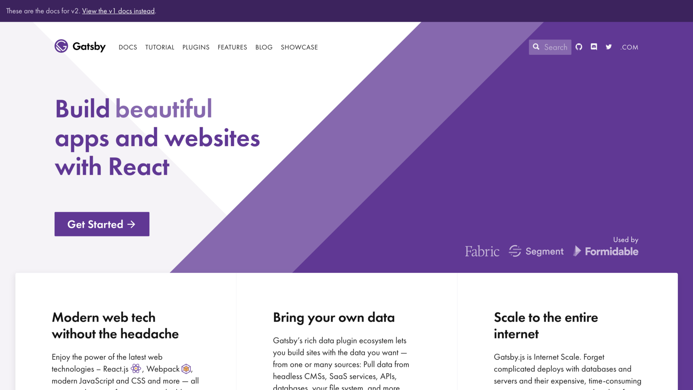

<span class="caption">Gatsby is able to build an optimized static website.</span>

Netlify CMS is able to provide the Markup data for a Gatsby website. Netlify CMS allows a user to enter content through an intuitive and easy to use interface which will then get used by Gatsby to create the appropriate pages for a web app. When saving content on Netlify CMS, the data gets saved into the web application’s git repository as markdown files.

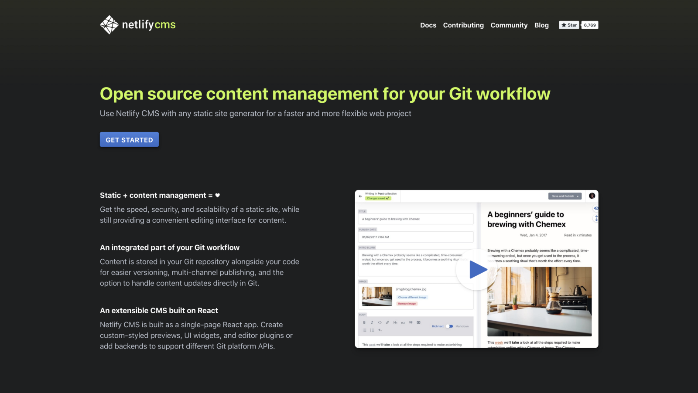

<span class="caption">Netlify CMS provides the data for a Gatsby website.</span>

After Gatsby has generated all web app files from its build process, the web app can then be deployed to a static website host such as <Link to="https://www.netlify.com/">Netlify</Link>, <Link to="https://zeit.co/now">Now</Link>, or <Link to="https://aws.amazon.com/s3/">Amazon S3</Link>.

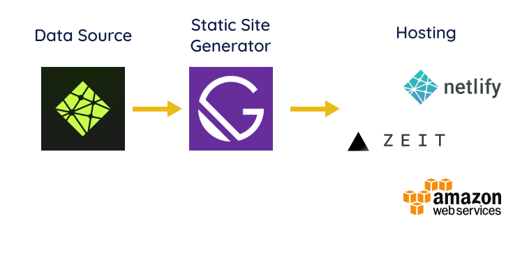

<span class="caption">Netlify CMS provides the data to Gatsby which then generates a static website that can be deployed to Netlify, Now, Amazon S3, or another static web host.</span>

## Walkthrough

This walkthrough will explain the main parts of a web app built with Gatsby and Netlify CMS. This walkthrough is based on an <Link to="https://gatsby-netlify-cms-example.netlify.com/">example web app</Link> created for a fictional JavaScript meetup group.

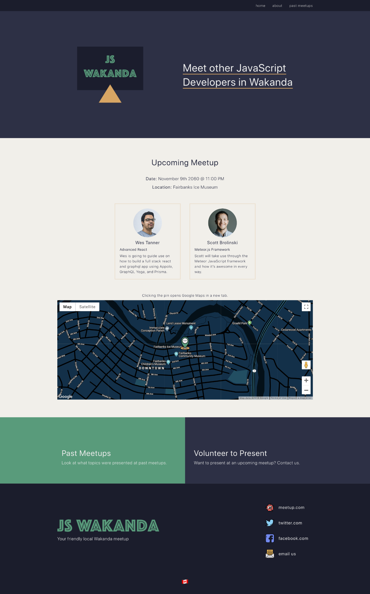

<span class="caption">Landing page of a fictional JavaScript meetup website built with Gatsby and Netlify CMS.</span>

You can <Link to="https://github.com/robertcoopercode/gatsby-netlify-cms">view the source code for the web app on Github</Link> and you can easily deploy your own instance of the app by clicking the “_Deploy to netlify_” button in the README. Clicking the “_Deploy to netlify_” button will direct you to Netlify’s website where it asks you to connect to your Github account so that it can clone the repository and then deploy an instance of the web app. I’d encourage you to use this “_Deploy to netlify_” button while following along with this walkthrough if you’d like to be able to access and explore the Netlify CMS yourself.

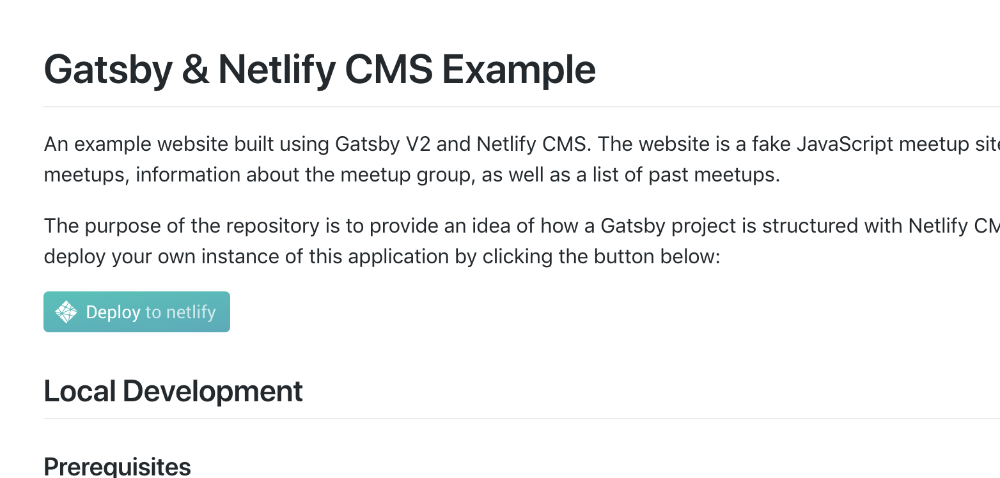

<span class="caption">The “Deploy to netlify” button is found in the example repository’s README and allows a user to quickly deploy the web app to a randomly generated URL.</span>

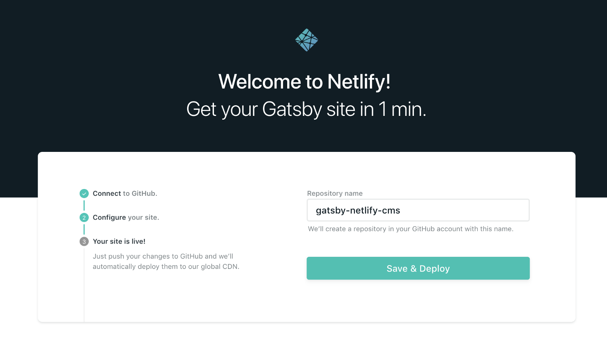

<span class="caption">These are some of the steps to quickly deploy an instance of the existing web app.</span>

## Accessing the CMS

To be able to access the Netlify CMS at the /admin route of the site, we’ll need to enable Netlify’s <Link to="https://github.com/netlify/git-gateway">_Git Gateway_</Link> through their <Link to="https://www.netlify.com/docs/identity/">_Identity_</Link> service. Git Gateway allows a user to have contributors added to the CMS without giving them full access to the code repository. Netlify’s <Link to="https://www.netlify.com/docs/identity/">Identity</Link> service handles all of the authentications and provides an interface for user management.

The next steps are to enable _Identity_ in the Netlify dashboard, invite yourself as a user, and then enable the _Git Gateway_.

Go ahead and click that “Enable Identity” button in the Netlify dashboard.

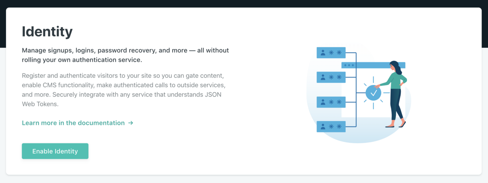

Next, click the “Invite users” button and invite yourself to be a user.

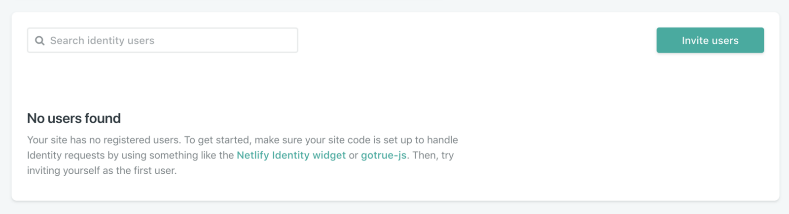

Make sure you “Enable Git Gateway” to allow Netlify to interface with your Github repository.

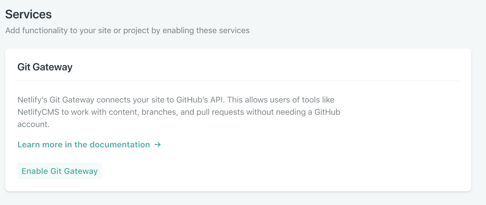

After inviting yourself and enabling the _Git Gateway_, you should have received an email inviting you to create a user for the app. After creating a user, you should be able to access the Netlify CMS for the web app by accessing the `/admin` route for your site and then logging in with the email and password you’ve just signed up with.

If you’re trying to find what the domain is used for the web app you deployed with Netlify, it can be found at the top of the overview page in the Netlify Dashboard.

In my case, I’ve customized the domain in settings to be `gatsby-netlify-cms-example.netlify.cms`. Therefore, the way I would access my app’s admin is by going to <Link to="https://gatsby-netlify-cms-example.netlify.com/admin">https://gatsby-netlify-cms-example.netlify.com/admin</Link>.

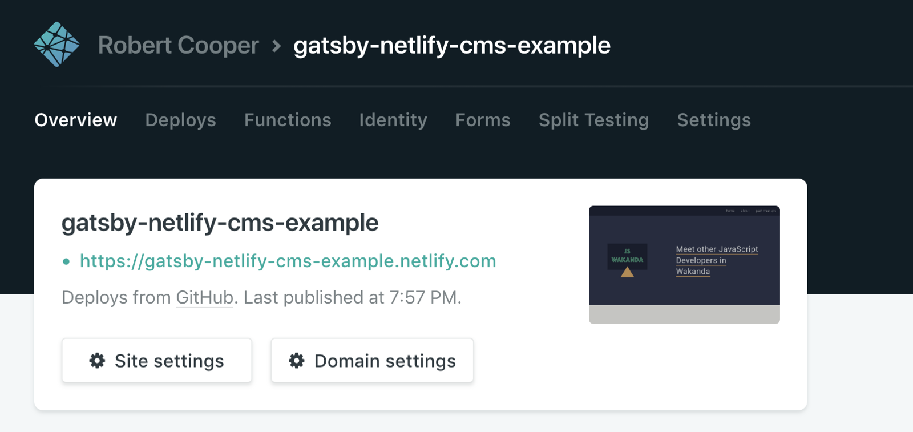

<span class="caption">The domain for the deployed web app is display in the overview section of the Netlify dashboard.</span>

Accessing <Link to="https://gatsby-netlify-cms-example.netlify.com/admin">https://gatsby-netlify-cms-example.netlify.com/admin</Link> for the web app prompts a user to login with a username and password as shown here.

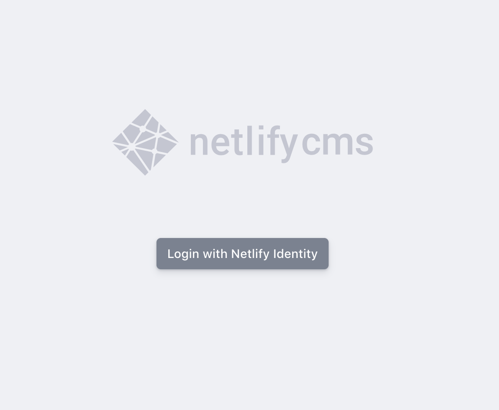

## Exploring the CMS

After authenticating into Netlify CMS there should be a page displaying the site’s collections on the left and a list of latest meetups on the right. All of the data that is inputted through the CMS will get stored into a Git repository when saved. Once there is a new commit to the Git repository, Netlify will trigger a Gatsby build of the app and then deploy the app with the new content (this is called <Link to="https://www.netlify.com/docs/continuous-deployment/">continuous deployment</Link>).

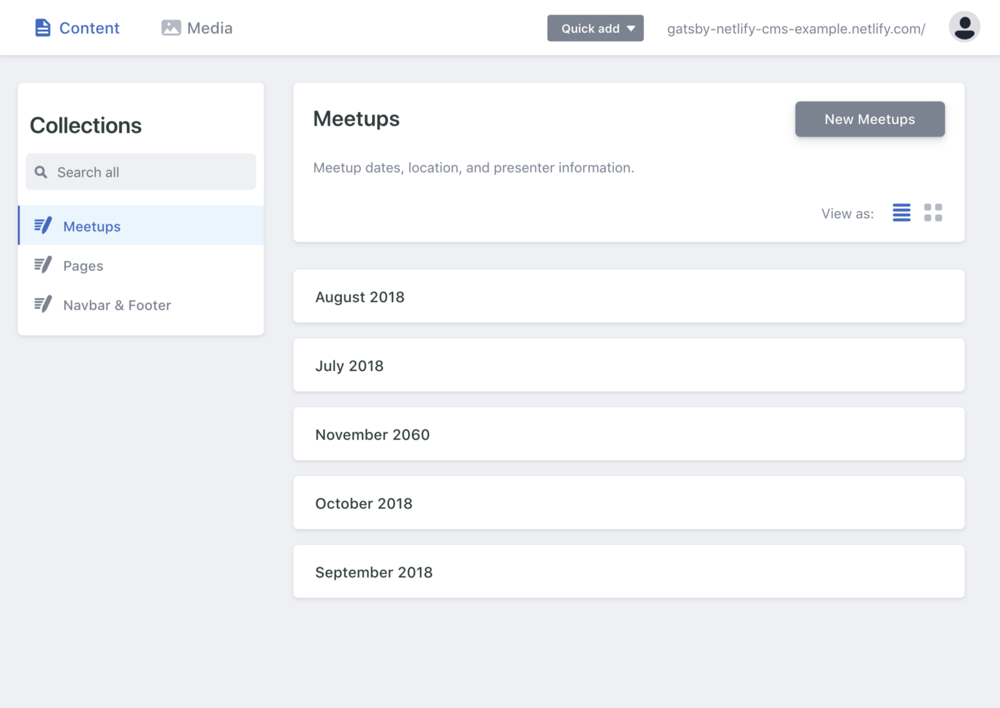

<span class="caption">The layout of the Netlify CMS for a web app after a user has passed authentication.</span>

A nice thing about Netlify CMS, is that you are able to have a live preview of your page while editing content in the CMS. Setting up the preview requires a bit of thought when setting up the React code and I also haven’t had luck in having images display immediately after uploading them, but it works decently well considering the complexities involved with displaying a live preview for a static site.

The app has been coded in such a way that all of the content that gets displayed on the website can be configured in the CMS (even the navigation bar and footer content)!

Here, we will be adding/editing a new meetup entry through the CMS.

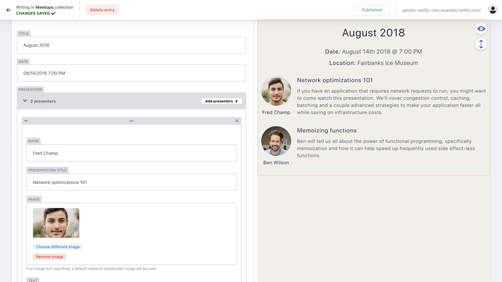

Now, we can edit the footer through the CMS.

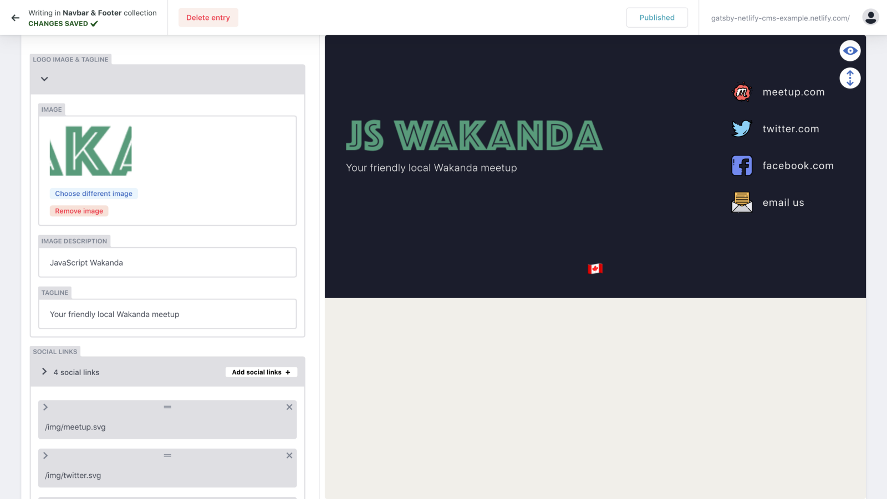

## Project structure

Let’s take a look at the code.

The project has two folders: `src/` and `static/`.

The `src/` directory contains all of the React components and Sass files that determine the app’s UI. The `src/` directory also holds the markdown files holding all text and data inputted into the CMS. When data is saved in the CMS, that data gets added inside of this `src/` directory in the form of markdown files.

The `static/` directory contains the images or files uploaded through the CMS as well as the CMS config. The CMS config file is a `config.yaml` file that determines the type of data that can be added through the CMS interface.

For example, `config.yaml` is where you would specify that you want to define a collection called “meetups” and that each meetup should have a title, date, list of presenters, and location associated with it. Read the documentation for more info on the <Link to="https://www.netlifycms.org/docs/configuration-options/">configuration file</Link>.

```yaml
...
collections:
  - name: "meetups"
    label: "Meetups"
    description: "Meetup dates, location, and presenter information."
    folder: "src/pages/meetups"
    create: true
    fields:
      - { label: "Template Key", name: "templateKey", widget: "hidden", default: "meetup" }
      - { label: "Title", name: "title", widget: "string" }
      - { label: "Date", name: "date", widget: "datetime" }
      - {
          label: Presenters,
          name: presenters,
          required: true,
          widget: list,
          fields:
            [
              { label: Name, name: name, required: true, widget: string },
              {
                label: Presentation Title,
                name: presentationTitle,
                required: false,
                widget: string,
              },
              ...
```

<span class="caption">The type of data that can be added to the CMS is specified by the configuration of data in the config.yaml file.</span>

**Getting data in React Components**

Gatsby is set up to use GraphQL to query for data inside of JavaScript files and turn into React components. When looking at a React page template file, you will see a GraphQL query at the bottom of the file which queries all of the data required for the page.

```jsx
...
export const aboutPageQuery = graphql`
  query AboutPage($id: String!) {
    markdownRemark(id: { eq: $id }) {
      html
      frontmatter {
        title
        mainImage {
          image
          imageAlt
        }
        gallery {
          image
          imageAlt
        }
        developerGroups
        organizers {
          title
          gallery {
            image
            imageAlt
            name
          }
        }
        seo {
          browserTitle
          title
          description
        }
      }
    }
    ...LayoutFragment
  }
`;
```

<span class="caption">GraphQL query for the website’s about page.</span>

The names of the queried data in the GraphQL query is based on the names of the fields provided in the `config.yml` file. However, some of the field names are less intuitive, such as `frontmatter` and `markdownRemark`. Fortunately, Gatsby comes with <Link to="https://github.com/graphql/graphiql">GraphiQL</Link> where you can explore all of the available data through GraphQL queries in the Gatsby application. GraphiQL also acts as a way to discover the names of all the GraphQL fields through its “Documentation Explorer”. GraphiQL can be accessed when running the web app locally (using `yarn develop`) and then accessing <Link to="http://localhost:8000/___graphql">http://localhost:8000/\_\_\_graphql</Link>.

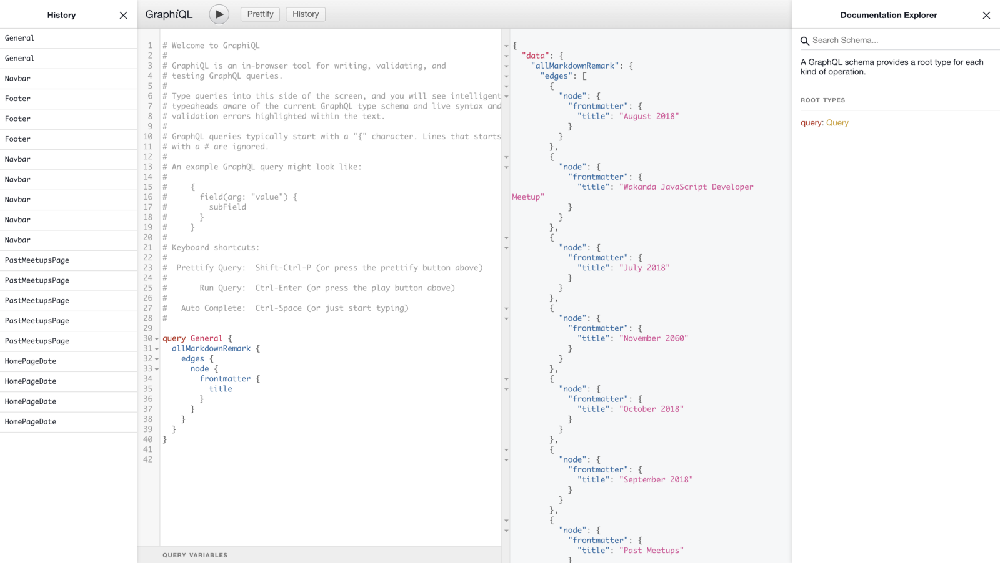_GraphiQL is a handy tool to allow a user to explore the available GraphQL queries and see what data gets returned from running different queries._

<span class="caption"></span>

Data queried with GraphQL in a React Component file allows for all of the queried data to be accessed through an object passed to the file’s exported React component.

```jsx
...

const AboutPage = ({ data }) => {
  const { markdownRemark: page, footerData, navbarData } = data;
  const {
    frontmatter: {
      seo: { title: seoTitle, description: seoDescription, browserTitle },
    },
  } = page;

  return (
    <Layout footerData={footerData} navbarData={navbarData}>
      <Helmet>
        <meta name="title" content={seoTitle} />
        <meta name="description" content={seoDescription} />
        <title>{browserTitle}</title>
      </Helmet>
      <AboutPageTemplate page={{ ...page, bodyIsMarkdown: false }} />
    </Layout>
  );
};

AboutPage.propTypes = {
  data: PropTypes.object.isRequired,
};

export default AboutPage;

...
```

<span class="caption">The exported <code class="language-text">AboutPage</code> component receives data provided by a GraphQL query.</span>

The above code is a React component for the About page. Notice how the above React component for the `AboutPage` template has a child component of `AboutPageTemplate`. The reason for having a child component to the `AboutPage` component is so that the `AboutPageTemplate` component can be exported and used to set up the About page’s preview that gets shown in the CMS. This is what was eluded to earlier when saying that the CMS preview feature requires a bit of thought during the setup of the React project.

## Developing locally and deploying

Running the web app locally is as simple as installing the project dependencies (yarn) and then running the start script (`yarn develop`).

Running the start script makes the site accessible at <Link to="http://localhost:8000/">http://localhost:8000/</Link>.

One thing to remember while developing is that once content has been added or modified through the CMS, you will need to run `git pull` locally to fetch the latest changes from the CMS.

Deploying any updates to the code to the live web app is as simple as pushing new commits to your remote git repository since Netlify will automatically build the app (`yarn build`) and serve the updated code.

When deploying, it’s a good idea to make sure the build script ran successfully because there may be some errors if some modifications have been made related to the structure of the data expected from the CMS. If the build fails, you will need to read the error message to see why the script failed to build the app and then make adjustments accordingly.

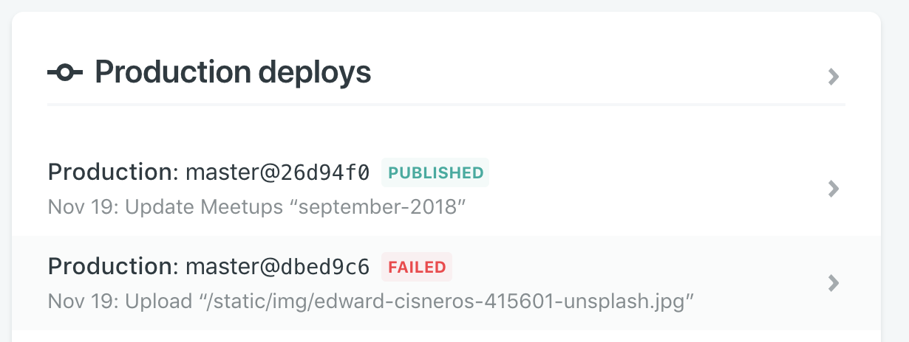

<span class="caption">Netlify will report the status of running the build script after new changes have been detected on the master branch of the application’s git repository.</span>

## Conclusion

If you’re interested in learning more about how Gatsby and Netlify CMS work together, you can explore <Link to="https://github.com/robertcoopercode/gatsby-netlify-cms">the source code</Link> for the above example application, refer to the <Link to="https://www.gatsbyjs.org/docs/">Gatsby</Link> and <Link to="https://www.netlifycms.org/docs/intro/">Netlify CMS</Link> documentation, as well as look at a <Link to="https://github.com/netlify-templates/gatsby-starter-netlify-cms">starter template</Link> for Gatsby and Netlify CMS.
