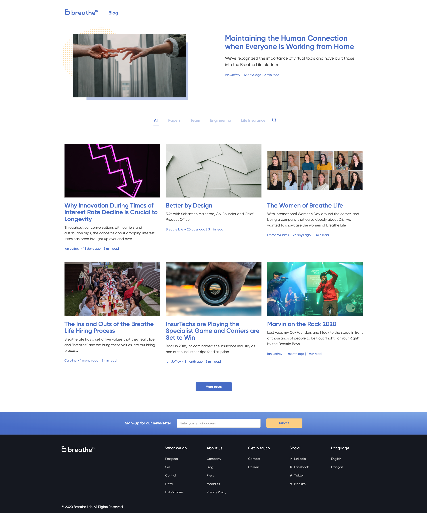
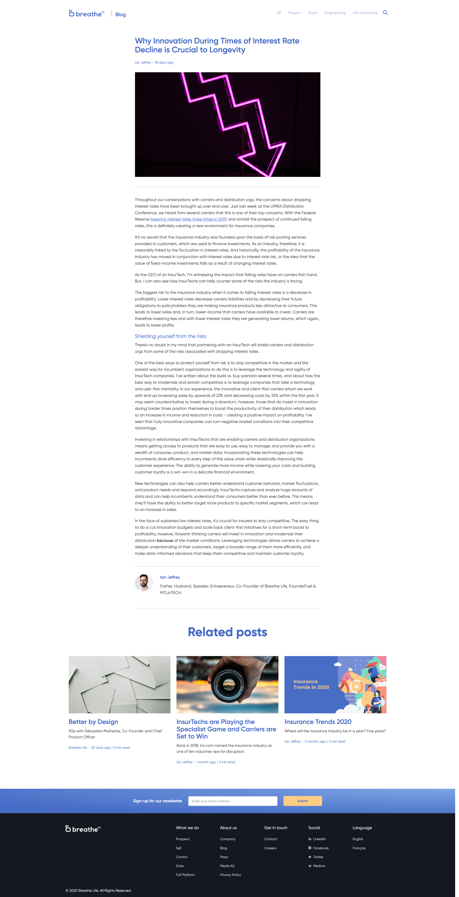
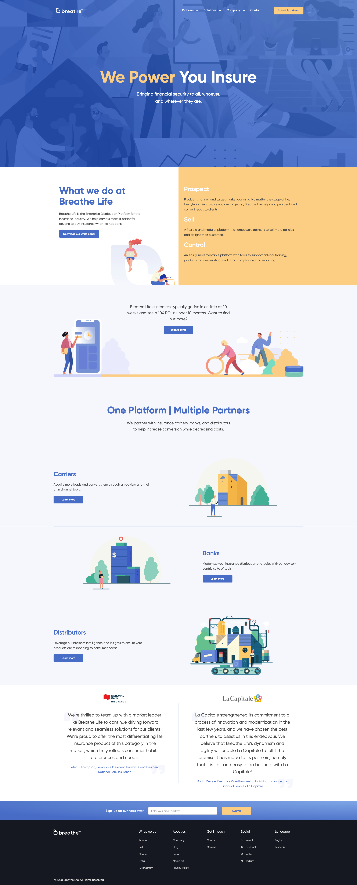
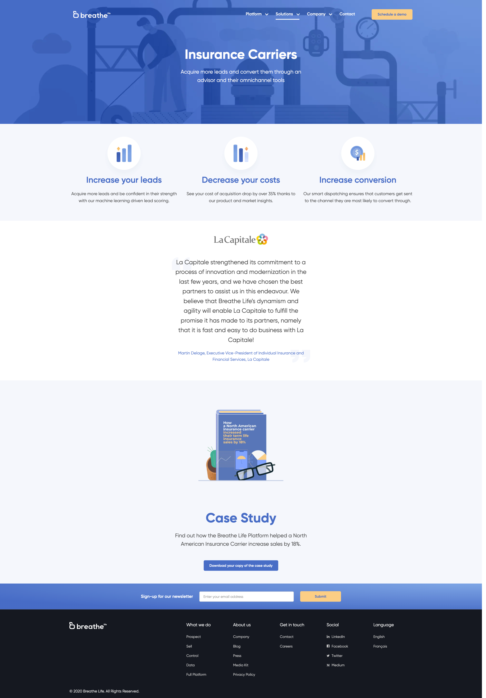

I was tasked with setting up the blog for the team at Breathe Life as well as updating their marketing site with new designs provided by their design team. Their site is built with [Gatsby](https://www.gatsbyjs.org/) and all their text and image content is managed with [Contentful](https://www.contentful.com/).

<TwoImages>

</TwoImages>
The blog home page and blog post page.

<TwoImages>

</TwoImages>
The main site's home page and one of the landing pages.
